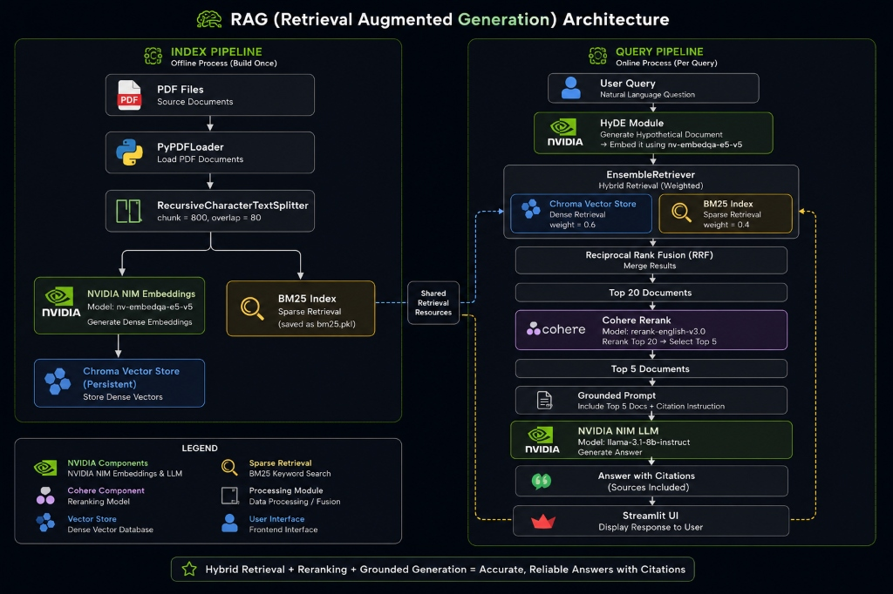

# Knowledge RAG

A production-grade RAG system for querying research papers using NVIDIA NIM models, hybrid search, Cohere reranking, and HyDE query expansion.

## Architecture



## Tech Stack

| Component | Tool |
|-----------|------|
| LLM | NVIDIA NIM — meta/llama-3.1-8b-instruct |
| Embeddings | NVIDIA NIM — nvidia/nv-embedqa-e5-v5 |
| Vector Store | Chroma (persistent) |
| Sparse Search | BM25 (rank-bm25) |
| Reranker | Cohere rerank-english-v3.0 |
| Query Expansion | HyDE |
| Observability | Custom SQLite-backed retrieval logger + LLM-judge faithfulness scoring |
| Framework | LangChain + Streamlit |
| Language | Python 3.12 |

## Features

- Hybrid search — BM25 + vector search merged with Reciprocal Rank Fusion
- Cohere reranking — retrieves 20 docs, reranks to top 5
- HyDE query expansion — generates hypothetical document for better retrieval
- Persistent index — index once, reloads automatically on every run
- Incremental indexing — only new PDFs get indexed, existing ones untouched
- Source citations — every answer cites the source PDF and page number
- No hallucination policy — answers strictly from provided documents
- Retrieval observability — every query logs retrieved chunks, scores, and latency; answers are scored for faithfulness against cited sources

## Project Structure

```
RAG/
├── src/
│   ├── __init__.py
│   ├── config.py             # API keys, model names, chunking settings
│   ├── ingestion.py          # PDF loading, chunking, embedding, indexing
│   ├── retrieval.py          # Hybrid search, RRF merging, Cohere reranking
│   ├── hyde.py                # HyDE query expansion
│   └── generation.py          # RAG chain, prompt, answer generation
├── rag_observability/
│   ├── __init__.py
│   ├── observability.py      # Query logging + LLM-judge faithfulness scoring
│   └── dashboard.py          # Streamlit tab rendering the observability view
├── docs/                       # PDF files (gitignored)
├── chroma_db/                  # Persistent vector store (gitignored)
├── app.py                      # Streamlit UI
├── bm25.pkl                    # BM25 index (gitignored)
├── indexed_files.txt           # Tracks which PDFs have been indexed
├── rag_logs.db                 # SQLite log of queries + faithfulness scores (gitignored)
├── requirements.txt
└── .env                         # API keys (gitignored)
```

## Setup

```bash
# Create virtual environment (used python 3.12)
python -m venv venv

# Activate (Windows)
venv\Scripts\activate

# Activate (Mac/Linux)
source venv/bin/activate

# Install dependencies
pip install -r requirements.txt
```

Create a `.env` file in the root:

```
NVIDIA_API_KEY=your_nvidia_api_key_here
COHERE_API_KEY=your_cohere_api_key_here
```

Get your API keys:
- NVIDIA: https://build.nvidia.com (free credits)
- Cohere: https://cohere.com (free trial)

## Run

```bash
streamlit run app.py
```

1. Add PDF files to the `docs/` folder
2. Click **Index New Documents** in the sidebar
3. Ask questions in the chat

On every subsequent run, the existing index loads automatically — no need to re-index.

## Adding New Documents

Drop any new PDF into the `docs/` folder and click **Index New Documents**. Only the new files will be indexed and appended to the existing vector store.

## Retrieval Observability

Every query is logged to a local SQLite database (`rag_logs.db`) with:

- Retrieved chunks at each pipeline stage (BM25, dense, RRF-fused, post-rerank)
- Final chunks sent to the LLM
- Answer latency
- HyDE on/off state

Each answer is additionally scored for **faithfulness**: the answer is split into claims, and an LLM judge checks whether each claim is supported by the cited chunks. This gives a lightweight proxy for RAGAS-style faithfulness scoring without requiring the full RAGAS dependency.

View the dashboard in the **Observability** tab inside the app.

**Known limitation:** faithfulness scores are currently volatile across queries (observed range roughly 0%-80% on a small sample), which suggests the claim-splitting or judge-prompt logic needs tuning rather than reflecting an actual pipeline problem. This is an active area of iteration — see the notes in `rag_observability/observability.py`.

## Known Limitations / Next Steps

- **Faithfulness scoring stability** — current LLM-judge approach shows high variance query to query; needs claim-splitter and judge-prompt refinement, or a swap to full RAGAS.
- **Query routing** — not implemented. All queries go through the same hybrid vector+BM25 path; there's no routing to structured/metadata lookups. Not needed at current corpus size, but a real gap if structured data sources are added later.
- **Entity resolution** — not implemented. Author/entity names are not normalized across chunks (e.g. "OpenAI" vs "Open AI" would index as distinct), which can quietly degrade rerank quality at larger corpus scale.
- **Failover** — no fallback if the Cohere rerank API fails or times out; a production version would degrade gracefully to RRF-only ranking.
- **LangSmith tracing** — pending, planned alongside full RAGAS integration.

## Test Questions

These questions were used to validate the system across multiple papers:

1. What are the key differences between RAG-Sequence and RAG-Token models?
2. How does Reflexion use verbal reinforcement learning to improve agent performance?
3. What datasets were used to evaluate the original RAG model and what were the results?
4. How does Self-RAG use critique tokens to assess relevance and support of retrieved passages?
5. What are the failure modes of the ReAct framework mentioned in the paper?

## Papers Indexed

| Paper | Authors | Year |
|-------|---------|------|
| Retrieval-Augmented Generation for Knowledge-Intensive NLP Tasks | Lewis et al. | 2020 |
| ReAct: Synergizing Reasoning and Acting in Language Models | Yao et al. | 2022 |
| Reflexion: Language Agents with Verbal Reinforcement Learning | Shinn et al. | 2023 |
| Self-RAG: Learning to Retrieve, Generate, and Critique | Asai et al. | 2023 |