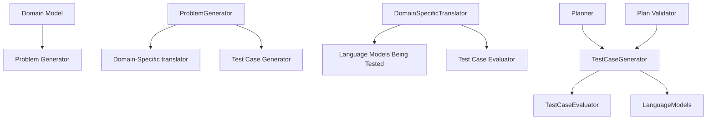

arXiv:2206.10498v4 [cs.CL] 26 Nov 2023

# **PlanBench: An Extensible Benchmark for Evaluating Large Language Models on Planning and Reasoning about Change**

**Karthik Valmeekam**
School of Computing & AI
Arizona State University, Tempe.
kvalmeek@asu.edu

**Matthew Marquez**
School of Computing & AI
Arizona State University, Tempe.
mmarqu22@asu.edu

**Alberto Olmo**
School of Computing & AI
Arizona State University, Tempe.
aolmoher@asu.edu

**Sarath Sreedharan**<sup>*</sup>
Department of Computer Science,
Colorado State University, Fort Collins.
sarath.sreedharan@colostate.edu

**Subbarao Kambhampati**
School of Computing & AI
Arizona State University, Tempe.
rao@asu.edu

## **Abstract**

Generating plans of action, and reasoning about change have long been considered a core competence of intelligent agents. It is thus no surprise that evaluating the planning and reasoning capabilities of large language models (LLMs) has become a hot topic of research. Most claims about LLM planning capabilities are however based on common sense tasks–where it becomes hard to tell whether LLMs are planning or merely retrieving from their vast world knowledge. There is a strong need for systematic and extensible planning benchmarks with sufficient diversity to evaluate whether LLMs have innate planning capabilities. Motivated by this, we propose PlanBench, an extensible benchmark suite based on the kinds of domains used in the automated planning community, especially in the International Planning Competition, to test the capabilities of LLMs in planning or reasoning about actions and change. PlanBench provides sufficient diversity in both the task domains and the specific planning capabilities. Our studies also show that on many critical capabilities–including plan generation–LLM performance falls quite short, even with the SOTA models. PlanBench can thus function as a useful marker of progress of LLMs in planning and reasoning.

## 1 Introduction

The advent of large pre-trained language models have revolutionized the field of natural language processing and have also received widespread public attention. These types of transformer-based large language models (LLMs) currently provide state-of-the-art performance in many of the standard NLP tasks. LLMs essentially predict the next word in a sentence, given a certain context and these models were originally developed to perform word sequence completion tasks. In the recent times, there

<sup>*</sup> Author was at Arizona State University during part of this work

37th Conference on Neural Information Processing Systems (NeurIPS 2023) Track on Datasets and Benchmarks.


have been anecdotal evidence and claims that they possess other capabilities that are not normally associated with sequence completion. This led to a sudden outburst of research probing and studying their behavior almost as if they were artificial organisms (c.f. [15]). In this paper, we are particularly interested in the line of research efforts that investigate (and showcase) the reasoning capabilities of Large Language models—including commonsense reasoning [31, 27, 5], logical reasoning [29], and even ethical reasoning [14]. These works have largely been suggesting that LLM's are indeed capable of doing such kinds of reasoning [17, 34, 2].

Planning is a reasoning task that has been well studied in the AI community. In its most basic form, planning involves coming up with a course of actions (policy) which when executed would take an agent from a certain initial state to a desired world state. Planning has generally been studied primarily as an inference problem on world and reward models. These models could either be specified by humans or learned by the agent by interacting with its world. In this paper, we want to look at the ability of large language models to do reasoning about actions and change involving common-sense planning tasks. We propose PlanBench, an extensible benchmark suite based on the kinds of domains used in the automated planning community, specially in International Planning Competitions (IPC) [13] to test this. Our focus on planning is spurred by not only the fact that it is a core aspect of human intelligence [26], but also that it is required for tasks considered as potential applications of LLMs including automatic code generation.

The contribution of our paper is a curriculum for evaluating planning, wherein we identify a set of related but distinct tasks, that are central for an agent to successfully perform planning and reasoning about actions and introduce a framework for developing code which is meant to auto-generate the possible queries for each. We initialize PlanBench with two IPC domains: Blocksworld and Logistics. We also provide obfuscated versions of these domains with the obfuscations being either misleading words or random alphanumeric strings. Overall, we provide ~26250 prompts as part of our dataset. We are also actively adding other IPC domains and tasks into the benchmark. The updated version of the entire benchmark, including the tools, datasets, and the scripts to reproduce the prompts and results in this paper, can be found at https://github.com/karthikv792/LLMs-Planning.

We are not the first to point out the need to perform such analyses of the reasoning capabilities of GPT-3 like LLMs. For example, [19] performed an analysis of GPT-3's reasoning capabilities on some example tasks, including different commonsense reasoning tasks varying from biological reasoning to arithmetic reasoning. However, the goal of this paper is fundamentally distinct from these earlier works in multiple ways. Firstly, we are not merely trying to point out a few example cases where LLMs fail but rather help establish an assessment framework for evaluating these systems' capabilities to perform planning. While this paper reports the results of testing Instruct-GPT3 [22] and GPT-4 [21], one could use this framework to analyse other LLMs that may be fine-tuned for such tasks. Secondly, through this framework, we are also trying to eliminate the subjective aspect of analysis that forms the core part of many of these earlier efforts. Instead, we automate and perform the analyses in a mechanistic way by leveraging automated planning models and tools to generate the queries and validate the system's answers.

## 2 Related Work

To the best of our knowledge, we are the first to introduce a benchmark specifically designed to evaluate the emerging planning abilities of LLMs, if any. The initial version of our benchmark was made public almost a year back and is currently in use by various researchers.<sup>2</sup> We have significantly increased the scope of our benchmark (with additional test cases and domains) from the initial version. But the idea of developing benchmarks to evaluate emergent properties of LLMs is itself not new. Some prominent existing reasoning benchmarks include, **BIG-BENCH** [29], GSM8K [3], AQUA [18], SVAMP [23], CommonsenseQA [31] and StrategyQA [5]. However, these tasks are simple involve shallow reasoning and do not give insight into their planning capabilities. As LLMs have been able to perform well on such tasks, there has been a lot more triumphalism about their planning capabilities, which is currently being echoed in the community.

There have been significant developments in the intersection of LLMs and planning, with LLMs undertaking various roles [16]. These roles range from generating plans [11, 33] and heuristics [33, 1]

<sup>2</sup>The number of stars (103) and forks (14) on our GitHub repository serves as an indirect estimate of the level of interest in our benchmark.

2


to extracting planning knowledge [7]. For example, in Say-Can [1], LLMs have been used as scoring models, which can be seen as providing planning heuristics, for the actions that the embodied robot can execute. Additionally, LLMs are also being made to use feedback from users or the environment to improve their planning performance [12, 35, 25].

Our work primarily establishes an assessment framework for evaluating a wide variety of planning capabilities of LLMs. PlanBench consists of multiple tasks, each designed to evaluate a certain aspect of reasoning about actions and change. The prompts for our tasks are showcased as few-shot examples where we provide an instance and an example completion and then ask for a completion on a new instance. Further, we use the domain description to explicitly constrain the possible actions. In many everyday scenarios, we are often asked to take into consideration unforeseen limitations and constraints. Our explicit domain description allows us to introduce such challenges and forces the LLMs to go beyond merely repeating possible information about the domain they may have come across in the training data. The ability to be conditional on the prompt is critical for the general systems to be customized for the specific domain of interest.

## 3 Background

As we are interested in investigating the basic planning problem, we want look at the most fundamental planning formalism, namely the goal-directed deterministic planning problem. These kinds of problems are colloquially referred to as *classical planning problems*.

Classical Planning Problems can be mathematically represented by using the tuple $P = \langle D, I, G \rangle$. $D$ is referred to as the problem domain, $I$ is the initial state and $G$ is the goal specification. The possible truth assignment over the predicates defines the state space for the planning problem. The domain is again defined by the tuple $D = \langle F, O \rangle$. $F$ corresponds to the set of fluents, i.e., the state variable used to define the state space and each fluent corresponds to a predicate with some arity, and $A$ correspond to the set of actions that can be performed as part of the planning problem. Each action $a_i[V] \in A$ (where $a_i$ is the operator label and $V$ is the variable used by the operator and each variable could be mapped to an object), can be further defined by two components, the precondition $prec[V]$ which describes *when* an action can be executed and the effects $eff[V]$ which defines *what happens* when an action is executed. We will assume that $prec[V]$ consists of a set of predicates defined over the variables $V$. An action is assumed to be executable only if its preconditions are met, i.e., the predicates in the precondition hold in the given state. The effects $eff[V]$ is further defined by the tuple $\langle add[V], del[V] \rangle$, where $add[V]$ or add effects is the set of predicates that will be set true by the action and $del[V]$ or delete effects is the set of predicates that will be set false by the action. An action is said to be grounded if we replace each of the variables with an object, else it is referred to as a lifted domain model (we use a similar convention to differentiate between lifted and grounded predicates). Below is a snippet of an action from a popular benchmark problem called Blockworld, in PDDL. The action corresponds to putting down a block on a table in that domain.

```
(:action put-down
 :parameters (?ob)
 :precondition (holding ?ob)
 :effect (and (clear ?ob) (arm-empty) (on-table ?ob)
          (not (holding ?ob))))
```

In the above snippet, the parameter line provides the possible variables, in this case $?ob$, which can stand for possible blocks. The precondition says that you can put down a block only if you are holding it (i.e. predicate $(holding \ ?ob)$ is true for the block). The effects tell you that after you execute the action put-down, the block will be on the table and will be clear. You won't be holding the block and the arm will be considered *empty*. The actions may additionally be associated with cost, in these cases, one could also talk about optimal plans, i.e., a plan $\pi$ is called an optimal one if no plan exists that is less costly than $\pi$.

The above description presents one of the simpler classes of planning models and can be extended in multiple ways including allowing for object typing (including type hierarchy), more complex forms of preconditions and conditional effects, not to mention supporting richer classes of planning formalisms.

3




Figure 1: The diagrammatic overview of the overall test framework. Our system consists of a domain-specific component that allows the generation of various instances of the specific PDDL planning problems and the translation from PDDL to text and back. The domain-independent component is responsible for generating the test instances that will be fed into the LLM and verifying the output generated by the LLM.

## 4 Assessment Architecture

Our basic test framework consists of two categories of components, the domain-independent ones, provided as part of the framework, and the domain-dependent components which need to be developed for each new domain we test.

**Domain independent component:** The domain-independent component is built around a planner and a plan verification component that takes various planning problems and crafts test instances corresponding to various curriculum items. This component provides the mechanism to verify the solutions generated by the LLM. The current method is going to operate almost exclusively on symbolic models (specifically ones specified using PDDL [20]) and other structured inputs compatible with such representations.

This component is responsible for generating the content for the various prompts that would be generated as part of the different test cases and for validating the output generated by the LLM. As discussed earlier, the component primarily works on formal representations of the problems, so it relies on the translator component to convert any information it generates to natural language or to convert natural language information back to formal representations. For each test case, we mainly rely on a domain-independent planner and a plan validator to generate the relevant information or to validate the output provided by the LLM. For some test cases, we incorporate domain-specific information while crafting the prompts. In each case, there is a test-case-specific component that uses the problems provided by the problem generator component to craft specific test-case content.

**Domain dependent component:** The domain-dependent component consists of three parts; a domain model, a problem generator and a translator. The lifted domain file describes the various actions that may be available to solve any given planning problem, the various predicates that could be used to describe the various relationships over the objects that may be present at a given problem instance of the domain, and the various types of objects that may be part of the given problem. The domain model is lifted as it does not refer to the actual objects that may be part of the problem, but instead, the actions are defined independently of the exact objects it may influence.

The role of the problem generator is to generate random problem instances consisting of various objects, initial states, and goals. These problems become the basis of generating the various test cases that we will be using throughout the framework. Any distributional requirements we hope to use in the tests could be built into this problem generator.

The translator converts the symbolic model information to natural language text and *vice versa* . Translating the prompts to natural language would benefit the users of the benchmark who might want to be in the loop to either impose additional constraints or evaluate the plan themselves as these two tasks are more naturally done in natural language. For the current testbed (described below), we

4


developed a template-based mechanism to achieve this. In particular, we provide a natural language template for each predicate and each action, and we form texts of states and plans by concatenating these individual strings. In terms of parsing natural language text back into structured forms, the particular task we are interested in is converting plans generated by the LLM back into plan forms that can be used by plan validator tools like [10]. Since we use our prompts to shape the LLM's output, we require each action in the plan to be listed on a different line. Then, we can parse the exact action and arguments of the action by either using template-based matching or by assuming that the verb in the sentence corresponds to the action and each noun corresponds to an object which forms a parameter of the action (then mapping it to a possible action).

## 5 Current Curriculum for Testing

In this section, we go over each specific test case we provide as part of PlanBench. Each test case is meant to evaluate a central reasoning about actions and change capability and is tested in the context of a common sense planning domain. Each test case makes use of the few shot query setting of LLM where the LLM is provided a few sample answers to the specific reasoning ability being tested and is asked to respond to a new instance.<sup>3</sup> The exact form of the prompt will depend on the specific test cases, but every instance will start with a description of the lifted planning domain that describes what actions can be executed, their preconditions and their effects. The current set of test cases includes the following cases:

1. Plan Generation - Can the LLM come up with valid plans that will achieve a specific goal?
2. Cost Optimal Planning - Can the LLM come up with plans that are optimal to achieve a specific goal?
3. Plan Verification - Can the LLM determine if a plan will successfully execute, and if not, can it explain why?
4. Reasoning about plan execution - Can the LLM reason about what happens when a plan is executed?
5. Robustness to goal reformulation - Can the LLM recognize the same goal when specified in different ways?
6. Ability to reuse plans - Can the LLM recognize scenarios where it can reuse part or the whole of the original plan to achieve the new goal?
7. Replanning - Can the LLM replan for cases where an unexpected change is reported?
8. Plan Generalization - Can the LLM take specific plans, extract underlying procedural patterns and apply them to a new instance?

Out of the eight test cases, the first two test cases correspond to actual planning problems (i.e. plan generation and cost-optimal planning) and the rest correspond to simpler auxiliary tasks related to reasoning about action and change. We ground the test cases in multiple domains based on the kinds employed in International Planning Competitions. The domain description is included at the beginning of every prompt. In the rest of the section, we discuss the structure of the prompt for each of the test cases. We provide an example prompt and the corresponding completion generated by an LLM for each of the test cases in the Appendix.

**Plan Generation:** Following the lifted domain description, the prompt consists of a few instances of planning problem descriptions (consisting of a description of the initial state, the goal) and the corresponding plan (which ends with a tag, henceforth referred to as the plan-end tag, that denotes the end of the plan) and finally, we end the prompt with a planning problem description. The plan-end tag (which is separate from the end-generation tag) is introduced to enable easier plan extraction in cases where the LLM also adds commentary along with the plan. In the case where our extractor cannot reasonably extract a plan from the response, we mark that instance as an incorrect one. We present an example prompt for this test case here. For the rest of the test cases, the examples are provided in the Appendix.

_________________

<sup>3</sup>While in this work we look only at one-shot natural language prompt configurations, we have also looked at various other prompt configurations (including zero-shot prompts, chain-of-thought prompts and pddl style prompts), specifically in the plan generation test case, in [33].

5


# One-shot prompt for Plan Generation with GPT-4's plan

========================

I am playing with a set of blocks where I need to arrange the blocks into stacks. Here are the
↔ actions I can do

Pick up a block
Unstack a block from on top of another block
Put down a block
Stack a block on top of another block

I have the following restrictions on my actions:
I can only pick up or unstack one block at a time.
I can only pick up or unstack a block if my hand is **empty**.
I can only pick up a block if the block is on the table and the block is clear. A block is clear
↔ if the block has no other blocks on top of it and if the block is not picked up.
I can only unstack a block from on top of another block if the block I am unstacking was really on
↔ top of the other block.
I can only unstack a block from on top of another block if the block I am unstacking is clear.
Once I pick up or unstack a block, I am holding the block.
I can only put down a block that I am holding.
I can only stack a block on top of another block if I am holding the block being stacked.
I can only stack a block on top of another block if the block onto which I am stacking the block
↔ is clear.
Once I put down or stack a block, my hand becomes empty.
Once you stack a block on top of a second block, the second block is no longer clear.

**[STATEMENT]**

As initial conditions I have that, the red block is clear, the blue block is clear, the yellow
↔ block is clear, the hand is empty, the blue block is on top of the orange block, the red block
↔ is on the table, the orange block is on the table and the yellow block is on the table.
My goal is to have that the orange block is on top of the blue block.

My plan is as follows:

**[PLAN]**
unstack the blue block from on top of the orange block
put down the blue block
pick up the orange block
stack the orange block on top of the blue block
[PLAN END]

**[STATEMENT]**

As initial conditions I have that, the red block is clear, the yellow block is clear, the hand is
↔ empty, the red block is on top of the blue block, the yellow block is on top of the orange
↔ block
↔ block, the blue block is on the table and the orange block is on the table.
My goal is to have that the orange block is on top of the red block.

My plan is as follows:

**[PLAN]**
---------- GPT-4 response ---------
unstack the yellow block from on top of the orange block
put down the yellow block
unstack the red block from on top of the blue block
put down the red block
pick up the orange block
stack the orange block on top of the red block
[PLAN END]
---------- Extracted plan ---------
(unstack yellow orange)
(put-down yellow)
(unstack red blue)
(put-down red)
(pick-up orange)
(stack orange red)

---------- Ground truth plan ---------
(unstack yellow orange)
(put-down yellow)
(pick-up orange)
(stack orange red)

=========================SUCCESS========================

**Cost-Optimal Planning:** The prompt is quite similar to the one used in the earlier test case with a few changes. We modify the lifted domain description by including a statement that associates a cost with each action. To make the concept of action cost better fit into common sense domains, we can

6


map the cost to more common concepts like the time taken for executing the action or the amount of money that needs to be spent to execute an action. In the case of each problem description, before the plan is presented we need to explicitly mention that the plan is trying to minimize cost (which depending on the scenario might correspond to saying that the plan takes the least amount of time or the plan correspond to the cheapest plan). The result generated by the LLM is evaluated similarly to the previous query, but in addition to checking if the plan is valid, we also check if the cost of the plan corresponds to the optimal plan cost.

**Plan Verification:** Plan verification involves determining whether a proposed plan will successfully execute and achieve the stated goals when applied from the given initial state. Here, the prompt will first include three example instances, the corresponding candidate plans and the verification details. The set of examples will contain one example with a goal reaching plan, one with a non-goal reaching plan and one with an inexecutable plan. The prompt then contains a new instance along with a candidate plan. The LLM is tasked with answering whether the candidate plan is valid. If it answers no, it must identify the first inexecutable action and atleast one associated missing precondition (if inexecutable) or at least one missing goal condition (if not goal reaching).

**Reasoning about plan execution:** Here the objective is not to check whether the LLM can come up with plans, or verify them, but rather if they can predict the outcome of executing an action. The prompt here again starts with the domain description, but instead of providing planning problems and plans, we provide a state, an action sequence and then the state that would result from executing that action sequence in the provided state. Finally the prompt ends with a new state and a new action sequence. The LLM is expected to come up with the resulting state, which is then checked by applying a plan executor that will try to identify what state will result from the execution of the current action sequence on the provided state. We always provide executable action sequences for this test case.

**Robustness to Goal Reformulation:** In this test case, we will see if the LLM can recognize goals it has seen before if they are slightly modified. Here the prompt remains the same as the one used for plan generation. However, all the example problems have the same initial state, and the last problem provided has not only the same initial state but also the same goal as the example problem. Here the goal may be obfuscated in a few ways, for example, the goal facts may be reordered or one might include a subset of the original goal specification (meaning the same plan would still work) or vice-versa. We can again use the same evaluation technique as the plan generation test case to validate the output.

**Ability to Reuse Plans:** In this test case, we are interested in seeing if the LLM can reuse plans or parts of plans that it has seen before. The prompt is again the same as the plan generation, but the prompt ends with a problem that can be solved by a prefix of a previously seen plan. We again keep the initial state the same across the example problems shown. The evaluation remains the same as the plan generation test case.

**Replanning:** Replanning corresponds to the problem where there may be an unexpected event that occurs while executing a plan and the system needs to come up with a new plan in response to the event. Here, we focus on the ability of the LLM to replan when unexpected changes are reported. The prompt here starts with a domain description, then a set of instances where an unexpected event occurred during execution, and a new plan in response to the event. In each instance, a planning problem and a corresponding plan are provided at the beginning, the execution of the plan is described and then an unexpected event is noted (event corresponds to some facts unexpectedly turning true or false) and then a new plan from the changed state is presented. The prompt ends with a new case where the plan after replanning is left out and the LLM is expected to complete. The evaluation involves checking whether the new plan is valid from the changed state. The LLM output is evaluated to be true if the new plan it generates achieves the goals from the unexpectedly changed state. For each of the domains, we constrain the unexpected event to be of a specific type. We describe these cases for each domain in the next section.

**Plan Generalization:** In this test case, we want to evaluate whether LLMs can recognize the underlying pattern in the plans provided in the prompt and reuse it for a new planning problem. The prompt is the same as the plan generation case, except that all plans were generated by a fixed program. Here the program may contain loops or conditional statements, but can only solve certain types of problems, that is, the initial state and goals meet certain conditions. Such programs can be

7


thought of as a direct generalization of line plans that we have considered in the rest of the paper [30]. Execution of this program for a specific planning problem generates a sequence of actions. In this case, we will provide some example traces generated from the program and ask LLM to come up with a plan for a new problem that could be solved by it. The evaluation again would be to take the generated plan and see if it is valid for the given problem. Since this task requires the use of specific problems that admit generalizable solutions, not every problem works for this task. As such, this task requires problems to be curated for each domain. To develop this set of problems, we select a domain-specific generalized behavior and then create several problems that can be accomplished by merely adding more iterations of the generalized behavior to an example plan. We detail our domain-specific selection of behavior in Section 6.

## 6 Dataset Details

### Distribution of Number of Objects Over Blocksworld Dataset

| Number of Objects | Instances |
| ----------------- | --------- |
| 0                 | 0         |
| 1                 | 0         |
| 2                 | 0         |
| 3                 | 100       |
| 4                 | 450       |
| 5                 | 60        |


### Distribution of Optimal Plan Length Over Blocksworld Dataset

| Optimal Plan Length | Instances |
| ------------------- | --------- |
| 0.0                 | 0         |
| 2.5                 | 45        |
| 4.0                 | 85        |
| 6.0                 | 155       |
| 7.5                 | 155       |
| 10.0                | 110       |
| 12.5                | 45        |
| 15.0                | 2         |


**Figure 2:** Distribution of the number of objects and optimal plan length for the Blocksworld problem set

While PlanBench makes it easy to run the curriculum on new domains, we initialize it with two different International Planning Competition (IPC) [13] domains: Blocksworld and Logistics. For each domain, we provide a description, distribution of selected problems, and details on domain-specific curriculum configurations below.

**Blocksworld:** The Blocksworld domain focuses on stacking blocks on a table. One hand is available to move blocks, and only one block may be moved by the hand at a time. Blocks cannot be moved if there are blocks on top of them and blocks cannot be stacked on a block with another block already on top of it. Goals specify the order that blocks within a stack should be stacked in but may include multiple stacks or ask for blocks to be left on the table. Blocks our identified with colors. We developed 600 instances which vary in the number of objects used as well as the optimal plan length: we visualize these distributions in Figure 2. For the plan generalization test case, we focus on problems that can be solved by repeatedly adding clear blocks to the stack and generate 500 instances separate from the main blocksworld dataset. For the replanning test case we constrain the unexpected event to be of a specific type: We execute a random prefix of the plan which ensures that some block is held at the end of that prefix. We then change the resulting state by stacking the held block onto another random block which is clear and make the hand empty. This change is reported and the LLM is asked to replan from the changed state.

**Logistics:** The Logistics domain involves moving packages between different locations. Locations are grouped by cities. Trucks can be used to move packages between locations in the same city and planes can be used to move packages between cities. Goals specify where packages should be moved. We generate 285 instances for this domain We provide the distribution of objects (which includes cities, locations, trucks, airplanes and packages) and optimal plan length over the problems in Figure 3. For the plan generalization test case we focus on problems that contain one or more instances of the following; dropping off a package at a location and picking up the next package at that same location, allowing for a chain of package movement within a city through a truck and finally have a package at an airport be flown to another airport. For the replanning test case, we execute a random prefix of the plan which ensures a package is in a truck or an airplane. We then shift the position of

8


# Distribution of Number of Objects Over Logistics Dataset

| Number of Objects | Instances |
| ----------------- | --------- |
| 8                 | 4         |
| 9                 | 4         |
| 10                | 5         |
| 11                | 6         |
| 12                | 9         |
| 13                | 12        |
| 14                | 10        |
| 15                | 10        |
| 16                | 12        |
| 17                | 13        |
| 18                | 15        |
| 19                | 11        |
| 20                | 32        |
| 21                | 17        |
| 22                | 16        |
| 23                | 37        |


# Distribution of Optimal Plan Length Over Logistics Dataset

| Optimal Plan Length | Instances |
| ------------------- | --------- |
| 1                   | 9         |
| 2                   | 7         |
| 3                   | 2         |
| 4                   | 8         |
| 5                   | 1         |
| 6                   | 4         |
| 7                   | 5         |
| 8                   | 4         |
| 9                   | 8         |
| 10                  | 3         |
| 11                  | 3         |
| 12                  | 4         |
| 13                  | 3         |
| 14                  | 4         |
| 15                  | 13        |
| 16                  | 9         |
| 17                  | 8         |
| 18                  | 13        |
| 19                  | 13        |
| 20                  | 13        |
| 21                  | 11        |
| 22                  | 11        |
| 23                  | 8         |
| 24                  | 7         |
| 25                  | 5         |
| 26                  | 4         |
| 27                  | 4         |
| 28                  | 6         |
| 29                  | 5         |
| 30                  | 4         |
| 31                  | 4         |
| 32                  | 2         |
| 33                  | 2         |
| 34                  | 1         |
| 35                  | 2         |
| 36                  | 1         |
| 40                  | 2         |
| 48                  | 1         |


Figure 3: Distribution of the number of objects and optimal plan length for the Logistics problem set the package from inside the truck or airplane to a random location which is not the goal location. This change is reported and the LLM is asked to replan from the changed state.

## **Obfuscation of domains:**
Although the domain specification is part of our prompts, the names of the objects (e.g. blocks, trucks), predicates (e.g. on-table, in-city) and actions (e.g. pickup, drive) still do provide connections to the commonsense knowledge that the pretrained LLMs possess. One intriguing question is whether the planning performance is based really only on the domain model or patterns discovered from these other background connections. In order to test this, as part of our benchmark, we also provide obfuscated versions of the above domains, where the action names, predicate names and object names are obfuscated either with misleading words or random alphanumeric strings. Note that, for a standard planner, the original domain and the obfuscated version are identical. Further, we also provide the code to perform arbitrary obfuscations for the above domains or any additional domains that might be added in the future.

On the whole, our dataset consists of ~26250 prompts across the various test cases and domains (including the obfuscated versions). We will now look at the results of GPT-4 and InstructGPT-3 on the Blocksworld domain in PlanBench.

## 7 Specimen Evaluation of PlanBench

While the objective of this paper is to make PlanBench available to other researchers, we also did some initial experiments to give useful baselines. Our evaluation here primarily focuses on two Large Language Models, GPT-4 and InstructGPT3. We used the OpenAI API to access these models. In particular, we evaluated the test framework on the Blocksworld domain. In Table 1, we have presented the results of GPT-4 and Instruct-GPT3 (text-davinci-002) on PlanBench. The best results within each model were observed for the auxiliary goal reformulation test cases. However, even the most effective model (GPT-4) falls short on most of the test cases in the Blocksworld domain of PlanBench. Overall, the performance of these LLMs on our benchmark shows that, as of right now, LLMs are pretty ineffective in reasoning about actions and change. PlanBench can thus serve as a useful marker of progress of LLMs in planning and reasoning. In a companion study [33], we conducted a deeper investigation into the planning abilities of current state-of-the-art LLMs, critically examining their plan generation abilities under various assumed roles. We performed experiments with different prompt configurations, delved into the failure modes of LLMs for autonomous plan generation and analyzed performance shifts when LLMs assume heuristic roles (LLM-Modulo settings) in planning systems.

## 8 Conclusion and Future Work

In this paper, we presented PlanBench, a reasoning assessment suite for large language models (LLMs) that consists of various test cases each evaluating a central aspect of planning and reasoning about actions and change. Our results show that even in simple common-sense planning domains, LLMs seem to display subpar performance. Our goal is to establish an extensible benchmark where researchers can evaluate the current and future large language models. Our assessment suite can

9


Table 1: PlanBench Results of GPT-4 and Instruct-GPT3 (text-davinci-002) on Blocksworld domain. The tasks in the highlighted rows correspond to actual planning problems while the others correspond to simpler auxiliary planning tasks.

| Task                                                                                                                                                                                                                                                                                                          | Instances correct<br/>GPT-4 | Instances correct<br/>I-GPT3 |
| ------------------------------------------------------------------------------------------------------------------------------------------------------------------------------------------------------------------------------------------------------------------------------------------------------------- | --------------------------- | ---------------------------- |
| **Plan Generation**<br/>We showcase an instance and the respective plan as an example and prompt the machine with a new instance.                                                                                                                                                                             | 206/600 (34.3%)             | 41/600 (6.8%)                |
| **Cost-Optimal Planning**<br/>We showcase an instance, the respective optimal plan and the associated cost as an example and prompt the machine with a new instance.                                                                                                                                          | 198/600 (33%)               | 35/600 (5.8%)                |
| **Plan Verification**<br/>We showcase three instances and three distinct plans (goal reaching, non goal-reaching and inexecutable) and present the respective validation and explanations. We then present a new instance and a plan and ask the machine for to verify and provide an explanation, if needed. | 352/600 (58.6%)             | 72/600 (12%)                 |
| **Reasoning About Plan Execution**<br/>We showcase an instance, an action sequence and the corresponding resulting state after executing the action sequence as an example. We then provide an instance and an executable action sequence and ask the machine to provide the resulting state.                 | 191/600 (31.8%)             | 4/600 (0.6%)                 |
| **Replanning**<br/>We showcase an instance, the respective plan and present an unexpected change of the state. We then also present a new plan from the changed state. Finally, for a new instance we repeat the same except we ask the machine for the new plan.                                             | 289/600 (48.1%)             | 40/600 (6.6%)                |
| **Plan Generalization**<br/>We showcase an instance and the respective plan as an example and prompt the machine with a new instance. The plans for both the instances can be generated by a fixed program containing loops and conditionals.                                                                 | 141/500 (28.2%)             | 49/500 (9.8%)                |
| **Plan Reuse**<br/>We showcase an instance and the respective plan as an example and prompt the machine with an instance which requires only a certain prefix of the plan provided in the example.                                                                                                            | 392/600 (65.3%)             | 102/600 (17%)                |
| **Robustness to Goal Reformulation (Shuffling goal predicates)**<br/>We showcase an instance and the respective plan as an example and prompt the machine with the same instance but shuffle the ordering of the goals.                                                                                       | 461/600 (76.8%)             | 467/600 (77.8%)              |
| **Robustness to Goal Reformulation (Full → Partial)**<br/>We showcase an instance with a fully specified goal state and the respective plan as an example and prompt the machine with the same instance but provide a partially specified goal state.                                                         | 522/600 (87%)               | 467/600 (77.8%)              |
| **Robustness to Goal Reformulation (Partial → Full)**<br/>We showcase an instance with a partially specified goal state and the respective plan as an example and prompt the machine with the same instance but provide a fully specified goal state.                                                         | 348/600 (58%)               | 363/600 (60.5%)              |


be improved in multiple ways in the future. For instance, evaluation metrics that consider partial correctness could be incorporated into the benchmark. Additionally, the benchmark could be extended to support more number of IPC domains. In conclusion, we hope that PlanBench encourages other researchers to test the capabilities of their systems across different LLM models [2, 4, 28, 36, 24, 32, 9] and even those that are finetuned for such tasks.

## 9 Acknowledgements

This research was supported by ONR grants N00014-18-1-2442, N00014-18-1-2840, N00014-19-1-2119 and N00014-23-1-2409, AFOSR grant FA9550-18-1-0067, DARPA SAIL-ON grant W911NF-19-2-0006, and a JP Morgan AI Faculty Research Grant to Kambhampati. Sreedharan was supported in part by NSF grant 2303019. We would also like to thank Kaya Stechly and Anil Murthy for their help in adding additional domains to the benchmark.

10


# References

[1] Michael Ahn, Anthony Brohan, Noah Brown, Yevgen Chebotar, Omar Cortes, Byron David, Chelsea Finn, Keerthana Gopalakrishnan, Karol Hausman, Alex Herzog, et al. Do as i can, not as i say: Grounding language in robotic affordances. *arXiv preprint arXiv:2204.01691*, 2022.

[2] Aakanksha Chowdhery, Sharan Narang, Jacob Devlin, Maarten Bosma, Gaurav Mishra, Adam Roberts, Paul Barham, Hyung Won Chung, Charles Sutton, Sebastian Gehrmann, et al. Palm: Scaling language modeling with pathways. *arXiv preprint arXiv:2204.02311*, 2022.

[3] Karl Cobbe, Vineet Kosaraju, Mohammad Bavarian, Jacob Hilton, Reiichiro Nakano, Christopher Hesse, and John Schulman. Training verifiers to solve math word problems. *arXiv preprint arXiv:2110.14168*, 2021.

[4] Nan Du, Yanping Huang, Andrew M Dai, Simon Tong, Dmitry Lepikhin, Yuanzhong Xu, Maxim Krikun, Yanqi Zhou, Adams Wei Yu, Orhan Firat, et al. GLaM: Efficient Scaling of Language Models with Mixture-of-Experts. pages 5547–5569, 2022.

[5] Mor Geva, Daniel Khashabi, Elad Segal, Tushar Khot, Dan Roth, and Jonathan Berant. Did aristotle use a laptop? a question answering benchmark with implicit reasoning strategies. *Transactions of the Association for Computational Linguistics*, 9:346–361, 2021.

[6] Malik Ghallab, Dana S. Nau, and Paolo Traverso. *Automated Planning and Acting*. Cambridge University Press, 2016.

[7] Lin Guan, Karthik Valmeekam, Sarath Sreedharan, and Subbarao Kambhampati. Leveraging pre-trained large language models to construct and utilize world models for model-based task planning. *arXiv preprint arXiv:2305.14909*, 2023.

[8] Malte Helmert. The fast downward planning system. *Journal of Artificial Intelligence Research*, 26:191–246, 2006.

[9] Jordan Hoffmann, Sebastian Borgeaud, Arthur Mensch, Elena Buchatskaya, Trevor Cai, Eliza Rutherford, Diego de Las Casas, Lisa Anne Hendricks, Johannes Welbl, Aidan Clark, et al. Training compute-optimal large language models. *arXiv preprint arXiv:2203.15556*, 2022.

[10] Richard Howey, Derek Long, and Maria Fox. VAL: Automatic plan validation, continuous effects and mixed initiative planning using PDDL. In *16th IEEE International Conference on Tools with Artificial Intelligence*, pages 294–301. IEEE, 2004.

[11] Wenlong Huang, Pieter Abbeel, Deepak Pathak, and Igor Mordatch. Language models as zero-shot planners: Extracting actionable knowledge for embodied agents. In *International Conference on Machine Learning*, pages 9118–9147. PMLR, 2022.

[12] Wenlong Huang, Fei Xia, Ted Xiao, Harris Chan, Jacky Liang, Pete Florence, Andy Zeng, Jonathan Tompson, Igor Mordatch, Yevgen Chebotar, et al. Inner monologue: Embodied reasoning through planning with language models. *arXiv preprint arXiv:2207.05608*, 2022.

[13] IPC. International planning competition. https://www.icaps-conference.org/competitions, 1998.

[14] Liwei Jiang, Jena D. Hwang, Chandrasekhar Bhagavatula, Ronan Le Bras, Maxwell Forbes, Jon Borchardt, Jenny Liang, Oren Etzioni, Maarten Sap, and Yejin Choi. Delphi: Towards Machine Ethics and Norms. *ArXiv*, abs/2110.07574, 2021.

[15] Subbarao Kambhampati. AI as (an Ersatz) Natural Science? https://cacm.acm.org/blogs/blog-cacm/261732-ai-as-an-ersatz-natural-science/fulltext, Jun 2022.

[16] Subbarao Kambhampati, Karthik Valmeekam, Matthew Marquez, and Lin Guan. On the role of large language models in planning, July 2023. Tutorial presented at the International Conference on Automated Planning and Scheduling (ICAPS), Prague. https://yochan-lab.github.io/tutorial/ICAPS-2023/.

[17] Takeshi Kojima, Shixiang Shane Gu, Machel Reid, Yutaka Matsuo, and Yusuke Iwasawa. Large Language Models are Zero-Shot Reasoners. *arXiv preprint arXiv:2205.11916*, 2022.

[18] Wang Ling, Dani Yogatama, Chris Dyer, and Phil Blunsom. Program induction by rationale generation: Learning to solve and explain algebraic word problems. *arXiv preprint arXiv:1705.04146*, 2017.

[19] Gary Marcus and Ernest Davis. Experiments testing GPT-3's ability at commonsense reasoning: results. https://cs.nyu.edu/ davise/papers/GPT3CompleteTests.html, 2020.

11


[20] Drew McDermott, Malik Ghallab, Adele E. Howe, Craig A. Knoblock, Ashwin Ram, Manuela M. Veloso, Daniel S. Weld, and David E. Wilkins. Pddl-the planning domain definition language. 1998.

[21] OpenAI. Gpt-4 technical report, 2023.

[22] Long Ouyang, Jeff Wu, Xu Jiang, Diogo Almeida, Carroll L Wainwright, Pamela Mishkin, Chong Zhang, Sandhini Agarwal, Katarina Slama, Alex Ray, et al. Training language models to follow instructions with human feedback. *arXiv preprint arXiv:2203.02155*, 2022.

[23] Arkil Patel, Satwik Bhattamishra, and Navin Goyal. Are NLP Models really able to Solve Simple Math Word Problems? *arXiv preprint arXiv:2103.07191*, 2021.

[24] Jack W Rae, Sebastian Borgeaud, Trevor Cai, Katie Millican, Jordan Hoffmann, Francis Song, John Aslanides, Sarah Henderson, Roman Ring, Susannah Young, et al. Scaling language models: Methods, analysis & insights from training gopher. *arXiv preprint arXiv:2112.11446*, 2021.

[25] Shreyas Sundara Raman, Vanya Cohen, Eric Rosen, Ifrah Idrees, David Paulius, and Stefanie Tellex. Planning with large language models via corrective re-prompting. *arXiv preprint arXiv:2211.09935*, 2022.

[26] Stuart J Russell and Peter Norvig. *Artificial intelligence a modern approach*. London, 2010.

[27] Keisuke Sakaguchi, Ronan Le Bras, Chandra Bhagavatula, and Yejin Choi. Winogrande: An adversarial winograd schema challenge at scale. *In Proceedings of the AAAI Conference on Artificial Intelligence*, volume 34, pages 8732–8740, 2020.

[28] Shaden Smith, Mostofa Patwary, Brandon Norick, Patrick LeGresley, Samyam Rajbhandari, Jared Casper, Zhun Liu, Shrimai Prabhumoye, George Zerveas, Vijay Korthikanti, et al. Using deepspeed and megatron to train megatron-turing nlg 530b, a large-scale generative language model. *arXiv preprint arXiv:2201.11990*, 2022.

[29] Aarohi Srivastava, Abhinav Rastogi, Abhishek Rao, Abu Awal Md Shoeb, Abubakar Abid, Adam Fisch, Adam R Brown, Adam Santoro, Adrià Garriga-Alonso, et al. Beyond the imitation game: Quantifying and extrapolating the capabilities of language models. *arXiv preprint arXiv:2206.04615*, 2022.

[30] Siddharth Srivastava, Shlomo Zilberstein, Neil Immerman, and Hector Geffner. Qualitative numeric planning. *In Proceedings of the AAAI Conference on Artificial Intelligence*, volume 25, pages 1010–1016, 2011.

[31] Alon Talmor, Jonathan Herzig, Nicholas Lourie, and Jonathan Berant. Commonsenseqa: A question answering challenge targeting commonsense knowledge. *arXiv preprint arXiv:1811.00937*, 2018.

[32] Romal Thoppilan, Daniel De Freitas, Jamie Hall, Noam Shazeer, Apoorv Kulshreshtha, Heng-Tze Cheng, Alicia Jin, Taylor Bos, Leslie Baker, Yu Du, et al. LaMDA: Language Models for Dialog Applications. *arXiv preprint arXiv:2201.08239*, 2022.

[33] Karthik Valmeekam, Matthew Marquez, Sarath Sreedharan, and Subbarao Kambhampati. On the planning abilities of large language models—a critical investigation. *arXiv preprint arXiv:2305.15771*, 2023.

[34] Jason Wei, Xuezhi Wang, Dale Schuurmans, Maarten Bosma, Ed Chi, Quoc Le, and Denny Zhou. Chain of thought prompting elicits reasoning in large language models. *arXiv preprint arXiv:2201.11903*, 2022.

[35] **Shunyu Yao**, **Jeffrey Zhao**, Dian Yu, Nan Du, Izhak Shafran, Karthik R Narasimhan, and Yuan Cao. React: Synergizing reasoning and acting in language models. *In The Eleventh International Conference on Learning Representations*, 2023.

[36] Susan Zhang, Stephen Roller, Naman Goyal, Mikel Artetxe, Moya Chen, Shuohui Chen, Christopher Dewan, Mona Diab, Xian Li, Xi Victoria Lin, et al. Opt: Open pre-trained transformer language models. *arXiv preprint arXiv:2205.01068*, 2022.

12


# **A Appendix**

## **Contents**

**1** **Introduction** 1
**2** **Related Work** 2
**3** **Background** 3
**4** **Assessment Architecture** 4
**5** **Current Curriculum for Testing** 5
**6** **Dataset Details** 8
**7** **Specimen Evaluation of PlanBench** 9
**8** **Conclusion and Future Work** 9
**9** **Acknowledgements** 10

**A Appendix** 13
A.1 Broader Impact . . . . . . . . . . . . . . . . . . . . . . . . . . . 14
A.2 Additional details on experiments . . . . . . . . . . . . . . . . . 14
A.3 Obfuscation experiments . . . . . . . . . . . . . . . . . . . . . . 14
A.4 Analysis of GPT-4 plans . . . . . . . . . . . . . . . . . . . . . . 15
    A.4.1 Comparison to the dataset . . . . . . . . . . . . . . . . . 15
    A.4.2 Failure modes analysis . . . . . . . . . . . . . . . . . . . 15
A.5 Plan Generation Prompts . . . . . . . . . . . . . . . . . . . . . 16
    A.5.1 Blocksworld . . . . . . . . . . . . . . . . . . . . . . . . 16
    A.5.2 Logistics . . . . . . . . . . . . . . . . . . . . . . . . . . 17
    A.5.3 Mystery Blocksworld . . . . . . . . . . . . . . . . . . . . . 18
A.6 Cost Optimal Planning Prompts . . . . . . . . . . . . . . . . . . 19
    A.6.1 Blocksworld . . . . . . . . . . . . . . . . . . . . . . . . . 19
    A.6.2 Logistics . . . . . . . . . . . . . . . . . . . . . . . . . . 20
    A.6.3 Mystery Blocksworld . . . . . . . . . . . . . . . . . . . . . 21
A.7 Plan Verification Promptss . . . . . . . . . . . . . . . . . . . . 22
    A.7.1 Blocksworld . . . . . . . . . . . . . . . . . . . . . . . . . 22
    A.7.2 Logistics . . . . . . . . . . . . . . . . . . . . . . . . . . 23
    A.7.3 Mystery Blocksworld . . . . . . . . . . . . . . . . . . . . . 25
A.8 Reasoning About Plan Execution Prompts . . . . . . . . . . . . 27
    A.8.1 Blocksworld . . . . . . . . . . . . . . . . . . . . . . . . . 27
    A.8.2 Logistics . . . . . . . . . . . . . . . . . . . . . . . . . . 28

13


A.8.3 Mystery Blockworld . . . . . . . . . . . . . . . . 29
**A.9 Replanning Prompts** . . . . . . . . . . . . . . . . 30
A.9.1 Blockworld . . . . . . . . . . . . . . . . . . . . . 30
A.9.2 Logistics . . . . . . . . . . . . . . . . . . . . . . 31
A.9.3 Mystery Blockworld . . . . . . . . . . . . . . . . 32
**A.10 Plan Generalization Prompts** . . . . . . . . . . . 33
A.10.1 Blockworld . . . . . . . . . . . . . . . . . . . . . 33
A.10.2 Logistics . . . . . . . . . . . . . . . . . . . . . . 35
A.10.3 Mystery Blockworld . . . . . . . . . . . . . . . . 37
**A.11 Plan Reuse Prompts** . . . . . . . . . . . . . . . . 39
A.11.1 Blockworld . . . . . . . . . . . . . . . . . . . . . 39
A.11.2 Logistics . . . . . . . . . . . . . . . . . . . . . . 40
A.11.3 Mystery Blockworld . . . . . . . . . . . . . . . . 41
**A.12 Robustness to Goal Reformulation (Shuffling goal predicates) Prompts** . . . . . . . . . . . . 41
A.12.1 Blockworld . . . . . . . . . . . . . . . . . . . . . 41
A.12.2 Logistics . . . . . . . . . . . . . . . . . . . . . . 42
A.12.3 Mystery Blockworld . . . . . . . . . . . . . . . . 43
**A.13 Robustness to Goal Reformulation (Full → Partial) Prompts** . . . . . . . . . . . . . . . . . 44
A.13.1 Blockworld . . . . . . . . . . . . . . . . . . . . . 44
A.13.2 Logistics . . . . . . . . . . . . . . . . . . . . . . 45
A.13.3 Mystery Blockworld . . . . . . . . . . . . . . . . 46
**A.14 Robustness to Goal Reformulation (Partial → Full) Prompts** . . . . . . . . . . . . . . . . . 47
A.14.1 Blockworld . . . . . . . . . . . . . . . . . . . . . 47
A.14.2 Logistics . . . . . . . . . . . . . . . . . . . . . . 48
A.14.3 Mystery Blockworld . . . . . . . . . . . . . . . . 49

## **A.1 Broader Impact**

PlanBench seeks to cover a broad range of tasks related to planning and reasoning. Our benchmark serves as a useful marker of progress of LLMs in planning and reasoning and enables efficient comparisons of performance between LLMs in such tasks. As for ethical concerns, PlanBench does not contain any personally-identifiable or privacy-related information. While PlanBench is intended to measure planning capabilities, there is no guarantee that deploying models for external planning, based solely on their performance on this benchmark will result in correct or safe plans.

## **A.2 Additional details on experiments**

All the experiments were run using the OpenAI API with all default parameters except the temperature. The temperature was made 0, making the LLMs deterministic. For GPT-4, the version we used had an 8k context window and was used between the months of March and June. We used the Fast-Downward system [8] as the planner and VAL [10] as the plan validator in our framework.

## **A.3 Obfuscation experiments**

As shown in Table 2, the performance of both GPT-4 and Instruct-GPT3 decreases significantly when the domain is obfuscated either deceptively or randomly. This shows that whatever planning

14


Table 2: Results of GPT-4 and Instruct-GPT3 for the Plan Generation test case.

| Domain                               | Instances correct<br/>GPT-4 | Instances correct<br/>InstructGPT-3 |
| ------------------------------------ | --------------------------- | ----------------------------------- |
| **Mystery Blocksworld (Deceptive)**  | 26/600 (4.3%)               | 14/600 (0.23%)                      |
| **Mystery Blocksworld (Randomized)** | 12/600 (2%)                 | 6/600 (1%)                          |


performance they showed in the Blocksworld domain was more likely due to pattern matching rather than reasoning (which should have been robust to such kinds of obfuscation).

**A.4 Analysis of GPT-4 plans**

**A.4.1 Comparison to the dataset**

| Optimal plan length | 3 blocks | 4 blocks | 5 blocks |
| ------------------- | -------- | -------- | -------- |
| 2                   | 15       | 30       | 0        |
| 4                   | 28       | 55       | 0        |
| 6                   | 42       | 110      | 4        |
| 8                   | 10       | 140      | 5        |
| 10                  | 0        | 98       | 12       |
| 12                  | 0        | 38       | 6        |


<table>
  <thead>
    <tr>
      <th>Optimal plan length</th>
      <th>3 blocks</th>
      <th>4 blocks</th>
      <th>5 blocks</th>
    </tr>
  </thead>
  <tbody>
    <tr>
      <td>2</td>
<td>10</td>
<td>8</td>
<td>0</td>
    </tr>
<tr>
      <td>4</td>
<td>12</td>
<td>20</td>
<td>2</td>
    </tr>
<tr>
      <td>6</td>
<td>18</td>
<td>38</td>
<td>4</td>
    </tr>
<tr>
      <td>8</td>
<td>8</td>
<td>32</td>
<td>0</td>
    </tr>
<tr>
      <td>10</td>
<td>0</td>
<td>38</td>
<td>0</td>
    </tr>
<tr>
      <td>12</td>
<td>0</td>
<td>8</td>
<td>0</td>
    </tr>
  </tbody>
</table>

Figure 4: The graph on the left shows the distribution of the number of instances in the Blocksworld domain over their optimal plan lengths. The graph on the right shows the distribution of the number of correct plans by GPT-4 over optimal plan lengths.

Figure 4 provides insight into how the optimal plan length and block count distributions of Blocksworld instances where GPT-4 provides a correct plan stacks up against the optimal plan length and block count distributions of all instances. By comparing the two figures, we notice that more "shallow" instances - instances with a smaller optimal plan length - do not necessarily see an increase in the performance of LLMs. While perhaps deviating from intuition for classical planners, this is not unexpected given the knowledge of how LLMs work: regardless of the specifics of an instance, LLMs will attempt to solve it by predicting the next token based on the weights and the context.

**A.4.2 Failure modes analysis**

To delve deeper into the failure cases of GPT-4, we performed a more forgiving evaluation of the validity of the generated plans in the plan generation test case. We used the concept of domain model relaxations from the automated planning community (which are used to derive heuristics [6]) and considered two types of relaxations: (i) *delete relaxation* which involves ignoring the delete conditions of the domain actions and (ii) *precondition relaxation* which ignores all the preconditions of the actions—thus assuming that any action is executable at any state giving their effects. We evaluated GPT-4's plans with respect to domain models that are delete-relaxed, precondition-relaxed or both. Note that a plan that is correct in the unrelaxed model will also be correct in all the relaxed versions. We observe (as shown in Figure 5) that even in the most relaxed version of the evaluation, GPT-4 still fails in a lot of instances.

15


### Blocksworld

| Relaxation Type         | Goal Reaching | Non Goal Reaching | Inexecutable |
| ----------------------- | ------------- | ----------------- | ------------ |
| Delete and Precondition | 460           | 140               | 0            |
| Precondition Only       | 430           | 170               | 0            |
| Delete Only             | 280           | 100               | 220          |
| Non-Relaxed             | 200           | 60                | 340          |


### Mystery Blocksworld

| Relaxation Type         | Goal Reaching | Non Goal Reaching | Inexecutable |
| ----------------------- | ------------- | ----------------- | ------------ |
| Delete and Precondition | 240           | 360               | 0            |
| Precondition Only       | 190           | 410               | 0            |
| Delete Only             | 40            | 30                | 530          |
| Non-Relaxed             | 20            | 20                | 560          |


**Figure 5: GPT-4 failure cases in the plan generation test case**

# A.5 Plan Generation Prompts

## A.5.1 Blocksworld

# Blocksworld Plan Generation Prompt with GPT-4 Completion

I am playing with a set of blocks where I need to arrange the blocks into stacks. Here are the ⇔ actions I can do

Pick up a block
Unstack a block from on top of another block
Put down a block
Stack a block on top of another block

I have the following restrictions on my actions:
I can only pick up or unstack one block at a time.
I can only pick up or unstack a block if my hand is empty.
I can only pick up a block if the block is on the table and the block is clear. A block is clear ⇔ if the block has no other blocks on top of it and if the block is not picked up.
I can only unstack a block from on top of another block if the block I am unstacking was really on ⇔ top of the other block.
I can only unstack a block from on top of another block if the block I am unstacking is clear.
Once I pick up or unstack a block, I am holding the block.
I can only put down a block that I am holding.
I can only stack a block on top of another block if I am holding the block being stacked.
I can only stack a block on top of another block if the block onto which I am stacking the block ⇔ is clear.
Once I put down or stack a block, my hand becomes empty.

**[STATEMENT]**
As initial conditions I have that, the red block is clear, the blue block is clear, the yellow ⇔ block is clear, the hand is empty, the blue block is on top of the orange block, the red block ⇔ is on ⇔ is on the table, the orange block is on the table and the yellow block is on the table.
My goal is to have that the orange block is on top of the blue block.

My plan is as follows:

**[PLAN]**
unstack the blue block from on top of the orange block
put down the blue block
pick up the orange block
stack the orange block on top of the blue block
**[PLAN END]**

**[STATEMENT]**
As initial conditions I have that, the red block is clear, the yellow block is clear, the hand is ⇔ empty ⇔ empty, the red block is on top of the blue block, the yellow block is on top of the orange ⇔ block, the blue block is on the table and the orange block is on the table.
My goal is to have that the orange block is on top of the red block.

My plan is as follows:

**[PLAN]**

-----------------GPT-4 response-----------------

16


unstack the yellow block from on top of the orange block
put down the yellow block
unstack the red block from on top of the blue block
put down the red block
pick up the orange block
stack the orange block on top of the red block
[PLAN END]

-------------Extracted LLM plan-------------
(unstack d c)
(put-down d)
(unstack a b)
(put-down a)
(pick-up c)
(stack c a)

-------------Ground truth plan-------------
(unstack d c)
(put-down d)
(pick-up c)
(stack c a)

================SUCCESS================

# A.5.2 Logistics

## Logistics Plan Generation Prompt with GPT-4 Completion

I have to plan logistics to transport packages within cities via trucks and between cities via <u>airplanes</u>. Locations within a city are directly connected (trucks can move between any two <u>such locations</u>), and so are the cities. In each city there is exactly one truck and each city <u>has one location that serves as an airport</u>.
Here are the actions that can be performed:

Load a package into a truck. For example, <u>load package_1 into truck_1 at location_1_1</u>.
Load a package into an airplane. For example, <u>load package_1 into airplane_1 at location_1_1</u>.
Unload a package from a truck. For example, <u>unload package_1 from truck_1 at location_1_1</u>.
Unload a package from an airplane. For example, <u>unload package_1 from airplane_1 at location_1_1</u>.
Drive a truck from one location to another location. For example, <u>drive truck_1 from location_1_1</u> <u>to location_1_2 in city_1</u>.
Fly an airplane from one city to another city. For example, <u>fly airplane_1 from location_1_1 to</u> <u>location_2_1</u>. Here <u>location_1_1</u> is the airport in <u>city_1</u> and <u>location_2_1</u> is the airport in <u>city_2</u>.

The following are the restrictions on the actions:
A package can be loaded into a truck only if the package and the truck are in the same location.
Once a package is loaded into a truck, the package is not at the location and is in the truck.
A package can be loaded into an airplane only if the package and the airplane are in the same <u>location</u>.
Once a package is loaded into an airplane, the package is not at the location and is in the <u>airplane</u>.
A package can be unloaded from a truck only if the package is in the truck.
Once a package is unloaded from a truck, the package is not in the truck and is at the location of <u>the truck</u>.
A package can be unloaded from an airplane only if the package in the airplane.
Once a package is unloaded from an airplane, the package is not in the airplane and is at the <u>location of the airplane</u>.
A truck can be driven from one location to another if the truck is at the from-location and both <u>from-location</u> and <u>to-location</u> are locations in the same city.
Once a truck is driven from one location to another, it is not at the from-location and is at the <u>to-location</u>.
An airplane can be flown from one city to another if the from-location and the to-location are <u>airports</u> and the airplane is at the from-location.
Once an airplane is flown from one city to another the airplane is not at the from-location and is <u>at the to-location</u>.

**[STATEMENT]**
As initial conditions I have that, <u>location_0_0</u> is an airport, <u>location_1_0</u> is an airport,
<u>airplane_0</u> is at <u>location_0_0</u>, <u>airplane_1</u> is at <u>location_0_0</u>, <u>package_0</u> is at <u>location_1_0</u>,
<u>truck_0</u> is at <u>location_0_0</u>, <u>truck_1</u> is at <u>location_1_0</u>, <u>location_0_0</u> is in the city <u>city_0</u> and
<u>location_1_0</u> is in the city <u>city_1</u>.
My goal is to have that <u>package_0</u> is at <u>location_0_0</u>.

My plan is as follows:

[PLAN]
fly <u>airplane_1</u> from <u>location_0_0</u> to <u>location_1_0</u>

17


```
load package_0 into airplane_1 at location_1_0
fly airplane_1 from location_1_0 to location_0_0
unload package_0 from airplane_1 at location_0_0
[PLAN END]

[STATEMENT]

As initial conditions I have that, <u>location_0_0</u> is an airport, <u>location_1_0</u> is an airport,
↔ <u>airplane_0</u> is at <u>location_1_0</u>, <u>airplane_1</u> is at <u>location_1_0</u>, <u>package_0</u> is at <u>location_1_0</u>,
↔ <u>truck_0</u> is at <u>location_0_0</u>, <u>truck_1</u> is at <u>location_1_0</u>, <u>location_0_0</u> is in the city <u>city_0</u> and
↔ <u>location_1_0</u> is in the city <u>city_1</u>.
My goal is to have that <u>package_0</u> is at <u>location_0_0</u>.

My plan is as follows:

[PLAN]
-------------Ground truth plan-------------
(load-airplane p0 a1 11-0)
(fly-airplane a1 11-0 10-0)
(unload-airplane p0 a1 10-0)
```

# **A.5.3 Mystery Blocksworld**

## Mystery Blocksworld Plan Generation Prompt with GPT-4 Completion

I am playing with a set of objects. Here are the actions I can do

- Attack object
- Feast object from another object
- Succumb object
- Overcome object from another object

I have the following restrictions on my actions:

- To perform Attack action, the following facts need to be true: Province object, Planet object, ↔ Harmony.
- Once Attack action is performed the following facts will be true: Pain object.
- Once Attack action is performed the following facts will be false: Province object, Planet ↔ object, Harmony.
- To perform Succumb action, the following facts need to be true: Pain object.
- Once Succumb action is performed the following facts will be true: Province object, Planet ↔ object, Harmony.
- Once Succumb action is performed the following facts will be false: Pain object.
- To perform Overcome action, the following needs to be true: Province other object, Pain ↔ object.
- Once Overcome action is performed the following will be true: Harmony, Province object, Object ↔ Craves other object.
- Once Overcome action is performed the following will be false: Province other object, Pain ↔ object.
- To perform Feast action, the following needs to be true: Object Craves other object, Province ↔ object, Harmony.
- Once Feast action is performed the following will be true: Pain object, Province other object.
- Once Feast action is performed the following will be false: , Object Craves other object, ↔ Province object, Harmony.

[STATEMENT]

As initial conditions I have that, object b craves object c, harmony, planet object a, planet ↔ object c, planet object d, province object a, province object b and province object d.
My goal is to have that object c craves object b.

My plan is as follows:

[PLAN]
feast object b from object c
succumb object b
attack object c
overcome object c from object b
[PLAN END]

[STATEMENT]

As initial conditions I have that, object a craves object b, object d craves object c, harmony,
↔ planet object b, planet object c, province object a and province object d.
My goal is to have that object c craves object a.

My plan is as follows:

[PLAN]

18


-------------Ground truth plan-------------
(feast object d object c)
(succumb object d)
(attack object c)
(overcome object c object a)

# A.6 Cost Optimal Planning Prompts

## A.6.1 Blocksworld

**Blocksworld Cost Optimal Planning Prompt with GPT-4 Completion**

I am playing with a set of blocks where I need to arrange the blocks into stacks. Here are the
↔ actions I can do:

Pick up a block. It takes 1 minute to pick up a block.
Unstack a block from on top of another block. It takes 1 minute to unstack a block from on top of
↔ another block.
Put down a block. It takes 1 minute to put down a block.
Stack a block on top of another block. It takes 1 minute to stack a block on top of another block.

I have the following restrictions on my actions:
I can only pick up or unstack one block at a time.
I can only pick up or unstack a block if my hand is empty.
I can only pick up a block if the block is on the table and the block is clear. A block is clear
↔ if the block has no other blocks on top of it and if the block is not picked up.
I can only unstack a block from on top of another block if the block I am unstacking was really on
↔ ↔ top of the other block.
I can only unstack a block from on top of another block if the block I am unstacking is clear.
Once I pick up or unstack a block, I am holding the block.
I can only put down a block that I am holding.
I can only stack a block on top of another block if I am holding the block being stacked.
I can only stack a block on top of another block if the block onto which I am stacking the block
↔ is clear.
Once I put down or stack a block, my hand becomes empty.
Once you stack a block on top of a second block, the second block is no longer clear.

**[STATEMENT]**
As initial conditions I have that, the red block is clear, the blue block is clear, the yellow
↔ block is clear, the hand is empty, the blue block is on top of the orange block, the red block
↔ is on the table, the orange block is on the table and the yellow block is on the table.
My goal is to have that the orange block is on top of the blue block. I want to minimize the time
↔ taken to achieve my goal.
My plan is as follows:

**[PLAN]**
unstack the blue block from on top of the orange block
put down the blue block
pick up the orange block
stack the orange block on top of the blue block
[PLAN END]
The total time to execute the plan is 4 minutes.

**[STATEMENT]**
As initial conditions I have that, the red block is clear, the yellow block is clear, the hand is
↔ empty
↔ empty, the red block is on top of the blue block, the yellow block is on top of the orange
↔ block
↔ block, the blue block is on the table and the orange block is on the table.
My goal is to have that the orange block is on top of the red block. I want to minimize the time
↔ taken to achieve my goal.
My plan is as follows:

**[PLAN]**
-------------GPT-4 response-------------
unstack the yellow block from on top of the orange block
put down the yellow block
unstack the red block from on top of the blue block
put down the red block
pick up the orange block
stack the orange block on top of the red block
[PLAN END]
The total time to execute the plan is 6 minutes.
-------------Extracted LLM plan-------------
(unstack yellow orange)
(put-down yellow)
(unstack red blue)

19


```
(put-down red)
(pick-up orange)
(stack orange red)

------------Ground truth plan------------
(unstack yellow orange)
(put-down yellow)
(pick-up orange)
(stack orange red)

=================FAILURE================
```

# A.6.2 Logistics

## Logistics Cost Optimal Planning Prompt with GPT-4 Completion

I have to plan logistics to transport packages within cities via trucks and between cities via ⇌ airplanes. Locations within a city are directly connected (trucks can move between any two ⇌ such locations), and so are the cities. In each city there is exactly one truck and each city ⇌ has one location that serves as an airport.
Here are the actions that can be performed:

Load a package into a truck. It takes one minute to do this action.
Load a package into an airplane. It takes one minute to do this action.
Unload a package from a truck. It takes one minute to do this action.
Unload a package from an airplane. It takes one minute to do this action.
Drive a truck from one location to another location. It takes two minutes to do this action.
Fly an airplane from one city to another city. It takes five minutes to do this action.

The following are the restrictions on the actions:
A package can be loaded into a truck only if the package and the truck are in the same location.
Once a package is loaded into a truck, the package is not at the location and is in the truck.
A package can be loaded into an airplane only if the package and the airplane are in the same ⇌ location.
Once a package is loaded into an airplane, the package is not at the location and is in the
⇌ airplane.
A package can be unloaded from a truck only if the package is in the truck.
Once a package is unloaded from a truck, the package is not in the truck and is at the location of
⇌ the truck.
A package can be unloaded from an airplane only if the package in the airplane.
Once a package is unloaded from an airplane, the package is not in the airplane and is at the
⇌ location of the airplane.
A truck can be driven from one location to another if the truck is at the from-location and both
⇌ from-location and to-location are locations in the same city.
Once a truck is driven from one location to another, it is not at the from-location and is at the
⇌ to-location.
An airplane can be flown from one city to another if the from-location and the to-location are
⇌ airports and the airplane is at the from-location.
Once an airplane is flown from one city to another the airplane is not at the from-location and is
⇌ at the to-location.

**[STATEMENT]**
As initial conditions I have that, location_0_0 is an airport, location_1_0 is an airport,
⇌ airplane_0 is at location_0_0, airplane_1 is at location_0_0, package_0 is at location_1_0,
⇌ truck_0 is at location_0_0, truck_1 is at location_1_0, location_0_0 is in the city city_0 and
⇌ location_1_0 is in the city city_1.
My goal is to have that package_0 is at location_0_0. I want to minimize the time taken to achieve
⇌ my goal.
My plan is as follows:

**[PLAN]**
fly airplane_1 from location_0_0 to location_1_0
load package_0 into airplane_1 at location_1_0
fly airplane_1 from location_1_0 to location_0_0
unload package_0 from airplane_1 at location_0_0
[PLAN END]
The total time to execute the plan is 4 minutes.

**[STATEMENT]**
As initial conditions I have that, location_0_0 is an airport, location_1_0 is an airport,
⇌ airplane_0 is at location_1_0, airplane_1 is at location_1_0, package_0 is at location_1_0,
⇌ truck_0 is at location_0_0, truck_1 is at location_1_0, location_0_0 is in the city city_0 and
⇌ location_1_0 is in the city city_1.
My goal is to have that package_0 is at location_0_0. I want to minimize the time taken to achieve
⇌ my goal.

20


My plan is as follows:

[PLAN]
-------------Ground truth plan-------------
(load-airplane p0 a1 11-0)
(fly-airplane a1 11-0 10-0)
(unload-airplane p0 a1 10-0)

# A.6.3 Mystery Blocksworld

**Mystery Blocksworld Cost Optimal Planning Prompt with GPT-4 Completion**

I am playing with a set of objects. Here are the actions I can do

Attack object. It takes 1 minute to do the Attack action.
Feast object from another object. It takes 1 minute to do the Feast action.
Succumb object. It takes 1 minute to do the Succumb action.
Overcome object from another object. It takes 1 minute to do the Overcome action.

I have the following restrictions on my actions:
To perform Attack action, the following facts need to be true: Province object, Planet object,
⇄ Harmony.
Once Attack action is performed the following facts will be true: Pain object.
Once Attack action is performed the following facts will be false: Province object, Planet object,
⇄ Harmony.
To perform Succumb action, the following facts need to be true: Pain object.
Once Succumb action is performed the following facts will be true: Province object, Planet object,
⇄ Harmony.
Once Succumb action is performed the following facts will be false: Pain object.
To perform Overcome action, the following needs to be true: Province other object, Pain object.
Once Overcome action is performed the following will be true: Harmony, Province object, Object
⇄ Craves other object.
Once Overcome action is performed the following will be false: Province other object, Pain object.
To perform Feast action, the following needs to be true: Object Craves other object, Province
⇄ object, Harmony.
Once Feast action is performed the following will be true: Pain object, Province other object.
Once Feast action is performed the following will be false:, Object Craves other object, Province
⇄ object, Harmony.

[STATEMENT]
As initial conditions I have that, object b craves object c, harmony, planet object a, planet
⇄ object c, planet object d, province object a, province object b and province object d.
My goal is to have that object c craves object b. I want to minimize the time taken to achieve my
⇄ goal.
My plan is as follows:

[PLAN]
feast object b from object c
succumb object b
attack object c
overcome object c from object b
[PLAN END]
The total time to execute the plan is 4 minutes.

[STATEMENT]
As initial conditions I have that, object a craves object b, object d craves object c, harmony,
⇄ planet object b, planet object c, province object a and province object d.
My goal is to have that object c craves object a. I want to minimize the time taken to achieve my
⇄ goal.
My plan is as follows:

[PLAN]
-------------Ground truth plan-------------
(feast object d object c)
(succumb object d)
(attack object c)
(overcome object c object a)

21


# **A.7 Plan Verification Promptss**

## **A.7.1 Blocksworld**

# Blocksworld Plan Verification Prompt with GPT-4 Completion

I am playing with a set of blocks where I need to arrange the blocks into stacks. Here are the ⇨ actions I can do

Pick up a block
Unstack a block from on top of another block
Put down a block
Stack a block on top of another block

I have the following restrictions on my actions:
I can only pick up or unstack one block at a time.
I can only pick up or unstack a block if my hand is empty.
I can only pick up a block if the block is on the table and the block is clear. A block is clear
⇨ if the block has no other blocks on top of it and if the block is not picked up.
I can only unstack a block from on top of another block if the block I am unstacking was really on
⇨ top of the other block.
I can only unstack a block from on top of another block if the block I am unstacking is clear.
Once I pick up or unstack a block, I am holding the block.
I can only put down a block that I am holding.
I can only stack a block on top of another block if I am holding the block being stacked.
I can only stack a block on top of another block if the block onto which I am stacking the block
⇨ is clear.
Once I put down or stack a block, my hand becomes empty.
Once you stack a block on top of a second block, the second block is no longer clear.

**[STATEMENT]**
As initial conditions I have that, the blue block is clear, the orange block is clear, the yellow
⇨ block is clear, the hand is empty, the blue block is on top of the red block, the red block is
⇨ on the ⇨ table, the orange block is on the table and the yellow block is on the table.
My goal is to have that the orange block is on top of the red block.
My plan is as follows:

**[PLAN]**
unstack the blue block from on top of the red block
put down the blue block
pick up the orange block
stack the orange block on top of the red block
[PLAN END]

**[VERIFICATION]**
The above plan is valid.

**[STATEMENT]**
As initial conditions I have that, the red block is clear, the orange block is clear, the white
⇨ block is clear, the hand is empty, the blue block is on top of the yellow block, the white
⇨ block is on top of the blue block, the red block is on the table, the orange block is on the
⇨ table and the yellow block is on the table.
My goal is to have that the blue block is on top of the yellow block, the orange block is on top
⇨ of the white block and the white block is on top of the red block.
My plan is as follows:

**[PLAN]**
unstack the white block from on top of the blue block
stack the white block on top of the red block
pick up the orange block
[PLAN END]

**[VERIFICATION]**
The above plan is invalid. This is the unmet goal condition:
the orange block is on top of the white block

**[STATEMENT]**
As initial conditions I have that, the yellow block is clear, the hand is empty, the red block is
⇨ on top of the white block, the blue block is on top of the orange block, the yellow block is
⇨ on top of the red block, the white block is on top of the blue block and the orange block is
⇨ on the table.
My goal is to have that the yellow block is on top of the white block.
My plan is as follows:

**[PLAN]**
unstack the yellow block from on top of the red block
pick up the yellow block
put down the yellow block
put down the red block

22


stack the yellow block on top of the white block
[PLAN END]

[VERIFICATION]
The above plan is invalid. The following action at step 2 has unmet preconditions:
pick up the yellow block
The unmet preconditions are:
the yellow block is clear, the hand is empty and the yellow block is on the table
[STATEMENT]
As initial conditions I have that, the red block is clear, the yellow block is clear, the hand is
↔ empty, the red block is on top of the blue block, the yellow block is on top of the orange
↔ block, the blue block is on the table and the orange block is on the table.
My goal is to have that the orange block is on top of the red block.
My plan is as follows:

[PLAN]
unstack the yellow block from on top of the orange block
put down the yellow block
pick up the orange block
[PLAN END]

[VERIFICATION]
-------------GPT-4 response-------------
The above plan is invalid. This is the unmet goal condition:
the orange block is on top of the red block
-------------Ground truth plan-------------
The above plan is invalid. This is the unmet goal condition:
the orange block is on top of the red block
===================SUCCESS==================

# A.7.2 Logistics

## Logistics Plan Verification Prompt with GPT-4 Completion

I have to plan logistics to transport packages within cities via trucks and between cities via
↔ airplanes. Locations within a city are directly connected (trucks can move between any two
↔ such locations), and so are the cities. In each city there is exactly one truck and each city
↔ has one location that serves as an airport.
Here are the actions that can be performed:

Load a package into a truck. For example, load package<sub>1</sub> into truck<sub>1</sub> at location<sub>1_1</sub>.
Load a package into an airplane. For example, load package<sub>1</sub> into airplane<sub>1</sub> at location<sub>1_1</sub>.
Unload a package from a truck. For example, unload package<sub>1</sub> from truck<sub>1</sub> at location<sub>1_1</sub>.
Unload a package from an airplane. For example, unload package<sub>1</sub> from airplane<sub>1</sub> at location<sub>1_1</sub>.
Drive a truck from one location to another location. For example, drive truck<sub>1</sub> from location<sub>1_1</sub>
↔ to location<sub>1_2</sub> in city<sub>1</sub>.
Fly an airplane from one city to another city. For example, fly airplane<sub>1</sub> from location<sub>1_1</sub> to
↔ location<sub>2_1</sub>. Here location<sub>1_1</sub> is the airport in city<sub>1</sub> and location<sub>2_1</sub> is the airport in
↔ city<sub>2</sub>.

The following are the restrictions on the actions:
A package can be loaded into a truck only if the package and the truck are in the same location.
Once a package is loaded into a truck, the package is not at the location and is in the truck.
A package can be loaded into an airplane only if the package and the airplane are in the same
↔ location.
Once a package is loaded into an airplane, the package is not at the location and is in the
↔ airplane.
A package can be unloaded from a truck only if the package is in the truck.
Once a package is unloaded from a truck, the package is not in the truck and is at the location of
↔ the truck.
A package can be unloaded from an airplane only if the package in the airplane.
Once a package is unloaded from an airplane, the package is not in the airplane and is at the
↔ location of the airplane.
A truck can be driven from one location to another if the truck is at the from-location and both
↔ from-location and to-location are locations in the same city.
Once a truck is driven from one location to another, it is not at the from-location and is at the
↔ to-location.
An airplane can be flown from one city to another if the from-location and the to-location are
↔ airports and the airplane is at the from-location.
Once an airplane is flown from one city to another the airplane is not at the from-location and is
↔ at the to-location.

[STATEMENT]

23


As initial conditions I have that, <u>location_0_0</u> is an airport, <u>location_1_0</u> is an airport,
↔ <u>location_2_0</u> is an airport, <u>airplane_0</u> is at <u>location_1_0</u>, <u>airplane_1</u> is at <u>location_2_0</u>,
↔ <u>package_0</u> is at <u>location_2_0</u>, <u>package_1</u> is at <u>location_1_0</u>, <u>truck_0</u> is at <u>location_0_0</u>,
↔ <u>truck_1</u> is at <u>location_1_0</u>, <u>truck_2</u> is at <u>location_2_0</u>, <u>location_0_0</u> is in the city <u>city_0</u>,
↔ <u>location_1_0</u> is in the city <u>city_1</u> and <u>location_2_0</u> is in the city <u>city_2</u>.
My goal is to have that <u>package_0</u> is at <u>location_2_0</u> and <u>package_1</u> is at <u>location_0_0</u>.
My plan is as follows:

[PLAN]
load <u>package_1</u> into <u>airplane_0</u> at <u>location_1_0</u>
fly <u>airplane_0</u> from <u>location_1_0</u> to <u>location_0_0</u>
unload <u>package_1</u> from <u>airplane_0</u> at <u>location_0_0</u>
[PLAN END]

[VERIFICATION]
The above plan is valid.

[STATEMENT]
As initial conditions I have that, <u>location_0_0</u> is an airport, <u>location_1_0</u> is an airport,
↔ <u>location_2_0</u> is an airport, <u>airplane_0</u> is at <u>location_2_0</u>, <u>airplane_1</u> is at <u>location_1_0</u>,
↔ <u>airplane_2</u> is at <u>location_2_0</u>, <u>package_0</u> is at <u>location_2_0</u>, <u>package_1</u> is at <u>location_0_1</u>,
↔ <u>package_2</u> is at <u>location_1_0</u>, <u>package_3</u> is at <u>location_2_1</u>, <u>package_4</u> is at <u>location_1_1</u>,
↔ <u>truck_0</u> is at <u>location_0_0</u>, <u>truck_1</u> is at <u>location_1_1</u>, <u>truck_2</u> is at <u>location_2_1</u>,
↔ <u>location_0_0</u> is in the city <u>city_0</u>, <u>location_0_1</u> is in the city <u>city_0</u>, <u>location_1_0</u> is in the
↔ city <u>city_1</u>, <u>location_1_1</u> is in the city <u>city_1</u>, <u>location_2_0</u> is in the city <u>city_2</u> and
↔ <u>location_2_1</u> is in the city <u>city_2</u>.
My goal is to have that <u>package_0</u> is at <u>location_2_1</u>, <u>package_1</u> is at <u>location_0_0</u>, <u>package_2</u> is
↔ at <u>location_0_1</u>, <u>package_3</u> is at <u>location_1_1</u> and <u>package_4</u> is at <u>location_2_0</u>.
My plan is as follows:

[PLAN]
load <u>package_2</u> into <u>airplane_1</u> at <u>location_1_0</u>
drive <u>truck_0</u> from <u>location_0_0</u> to <u>location_0_1</u> in <u>city_0</u>
fly <u>airplane_1</u> from <u>location_1_0</u> to <u>location_0_0</u>
unload <u>package_3</u> from <u>truck_1</u> at <u>location_1_1</u>
drive <u>truck_0</u> from <u>location_0_1</u> to <u>location_0_0</u> in <u>city_0</u>
unload <u>package_1</u> from <u>truck_0</u> at <u>location_0_0</u>
fly <u>airplane_2</u> from <u>location_2_0</u> to <u>location_1_0</u>
unload <u>package_3</u> from <u>airplane_2</u> at <u>location_1_0</u>
load <u>package_1</u> into <u>truck_0</u> at <u>location_0_1</u>
drive <u>truck_1</u> from <u>location_1_0</u> to <u>location_1_1</u> in <u>city_1</u>
unload <u>package_2</u> from <u>truck_0</u> at <u>location_0_1</u>
unload <u>package_4</u> from <u>truck_1</u> at <u>location_1_0</u>
load <u>package_0</u> into <u>truck_2</u> at <u>location_2_0</u>
unload <u>package_0</u> from <u>truck_2</u> at <u>location_2_1</u>
load <u>package_2</u> into <u>truck_0</u> at <u>location_0_0</u>
unload <u>package_4</u> from <u>airplane_2</u> at <u>location_2_0</u>
load <u>package_3</u> into <u>airplane_2</u> at <u>location_2_0</u>
drive <u>truck_2</u> from <u>location_2_0</u> to <u>location_2_1</u> in <u>city_2</u>
drive <u>truck_2</u> from <u>location_2_1</u> to <u>location_2_0</u> in <u>city_2</u>
unload <u>package_2</u> from <u>airplane_1</u> at <u>location_0_0</u>
unload <u>package_3</u> from <u>truck_2</u> at <u>location_2_0</u>
load <u>package_3</u> into <u>truck_2</u> at <u>location_2_1</u>
load <u>package_4</u> into <u>airplane_2</u> at <u>location_1_0</u>
load <u>package_4</u> into <u>truck_1</u> at <u>location_1_1</u>
drive <u>truck_1</u> from <u>location_1_1</u> to <u>location_1_0</u> in <u>city_1</u>
fly <u>airplane_0</u> from <u>location_1_0</u> to <u>location_2_0</u>
[PLAN END]

[VERIFICATION]
The above plan is invalid.The following action at step 4 has an unmet precondition:
unload <u>package_3</u> from <u>truck_1</u> at <u>location_1_1</u>
The unmet precondition is:
<u>package_3</u> is in <u>truck_1</u>
[STATEMENT]
As initial conditions I have that, <u>location_0_0</u> is an airport, <u>location_1_0</u> is an airport,
↔ <u>location_2_0</u> is an airport, <u>airplane_0</u> is at <u>location_2_0</u>, <u>airplane_1</u> is at <u>location_2_0</u>,
↔ <u>package_0</u> is at <u>location_0_1</u>, <u>package_1</u> is at <u>location_1_1</u>, <u>package_2</u> is at <u>location_1_1</u>,
↔ <u>package_3</u> is at <u>location_2_1</u>, <u>package_4</u> is at <u>location_1_0</u>, <u>package_5</u> is at <u>location_2_1</u>,
↔ <u>truck_0</u> is at <u>location_0_1</u>, <u>truck_1</u> is at <u>location_1_1</u>, <u>truck_2</u> is at <u>location_2_1</u>,
↔ <u>location_0_0</u> is in the city <u>city_0</u>, <u>location_0_1</u> is in the city <u>city_0</u>, <u>location_1_0</u> is in the
↔ city <u>city_1</u>, <u>location_1_1</u> is in the city <u>city_1</u>, <u>location_2_0</u> is in the city <u>city_2</u> and
↔ <u>location_2_1</u> is in the city <u>city_2</u>.
My goal is to have that <u>package_0</u> is at <u>location_1_1</u>, <u>package_1</u> is at <u>location_2_0</u>, <u>package_2</u> is
↔ at <u>location_1_0</u>, <u>package_3</u> is at <u>location_1_0</u>, <u>package_4</u> is at <u>location_1_1</u> and <u>package_5</u> is
↔ at <u>location_1_0</u>.
My plan is as follows:

24


[PLAN]
load package_5 into truck_2 at location_2_1
load package_3 into truck_2 at location_2_1
~~drive truck_2 from location_2_1 to location_2_0 in city_2~~
~~unload package_5 from truck_2 at location_2_0~~
~~unload package_3 from truck_2 at location_2_0~~
load package_2 into truck_1 at location_1_1
load package_1 into truck_1 at location_1_1
load package_0 into truck_0 at location_0_1
~~drive truck_0 from location_0_1 to location_0_0 in city_0~~
~~unload package_0 from truck_0 at location_0_0~~
load package_5 into airplane_1 at location_2_0
load package_3 into airplane_1 at location_2_0
~~drive truck_1 from location_1_1 to location_1_0 in city_1~~
load package_4 into truck_1 at location_1_0
~~unload package_2 from truck_1 at location_1_0~~
fly airplane_1 from location_2_0 to location_0_0
load package_0 into airplane_1 at location_0_0
fly airplane_1 from location_0_0 to location_1_0
~~unload package_5 from airplane_1 at location_1_0~~
~~unload package_3 from airplane_1 at location_1_0~~
~~unload package_0 from airplane_1 at location_1_0~~
load package_0 into truck_1 at location_1_0
~~unload package_1 from truck_1 at location_1_0~~
~~drive truck_1 from location_1_0 to location_1_1 in city_1~~
~~unload package_4 from truck_1 at location_1_1~~
~~unload package_0 from truck_1 at location_1_1~~
load package_1 into airplane_1 at location_1_0
fly airplane_1 from location_1_0 to location_2_0
[PLAN END]

[VERIFICATION]
The above plan is invalid. This is the unmet goal condition:
package_1 is at location_2_0

[STATEMENT]
As initial conditions I have that, location_0_0 is an airport, location_1_0 is an airport,
~~↔~~ airplane_0 is at location_1_0, airplane_1 is at location_1_0, package_0 is at location_1_0,
~~↔~~ truck_0 is at location_0_0, truck_1 is at location_1_0, location_0_0 is in the city city_0 and
~~↔~~ location_1_0 is in the city city_1.
My goal is to have that package_0 is at location_0_0.
My plan is as follows:

[PLAN]
load package_0 into airplane_1 at location_1_0
unload package_0 from airplane_1 at location_0_0
[PLAN END]

[VERIFICATION]
-------------Ground truth plan-------------
The above plan is invalid.The following action at step 2 has an unmet precondition:
unload package_0 from airplane_1 at location_0_0
The unmet precondition is:
airplane_1 is at location_0_0

**A.7.3 Mystery Blocksworld**

# Mystery Blocksworld Plan Verification Prompt with GPT-4 Completion

I am playing with a set of objects. Here are the actions I can do

- Attack object
- Feast object from another object
- Succumb object
- Overcome object from another object

I have the following restrictions on my actions:
- To perform Attack action, the following facts need to be true: Province object, Planet object, ~~↔~~ Harmony.
- Once Attack action is performed the following facts will be true: Pain object.
- Once Attack action is performed the following facts will be false: Province object, Planet ~~↔~~ object, Harmony.
- To perform Succumb action, the following facts need to be true: Pain object.
- Once Succumb action is performed the following facts will be true: Province object, Planet ~~↔~~ object, Harmony.
- Once Succumb action is performed the following facts will be false: Pain object.

25


To perform Overcome action, the following needs to be true: Province other object, Pain
<=> object.
Once Overcome action is performed the following will be true: Harmony, Province object, Object
<=> Craves other object.
Once Overcome action is performed the following will be false: Province other object, Pain
<=> object.
To perform Feast action, the following needs to be true: Object Craves other object, Province
<=> object, Harmony.
Once Feast action is performed the following will be true: Pain object, Province other object.
Once Feast action is performed the following will be false:, Object Craves other object,
<=> Province object, Harmony.

[STATEMENT]
As initial conditions I have that, object b craves object a, harmony, planet object a, planet
<=> object c, planet object d, province object b, province object c and province object d.
My goal is to have that object c craves object a.
My plan is as follows:

[PLAN]
feast object b from object a
succumb object b
attack object c
overcome object c from object a
[PLAN END]

[VERIFICATION]
The above plan is valid.

[STATEMENT]
As initial conditions I have that, object b craves object d, object e craves object b, harmony,
<=> planet object a, planet object c, planet object d, province object a, province object c and
<=> province object e.
My goal is to have that object b craves object d, object c craves object e and object e craves
<=> object a.
My plan is as follows:

[PLAN]
feast object e from object b
overcome object e from object a
attack object c
[PLAN END]

[VERIFICATION]
The above plan is invalid. This is the unmet goal condition:
object c craves object e
[STATEMENT]
As initial conditions I have that, object a craves object e, object b craves object c, object d
<=> craves object a, object e craves object b, harmony, planet object c and province object d.
My goal is to have that object d craves object e.
My plan is as follows:

[PLAN]
feast object d from object a
attack object d
succumb object d
succumb object a
overcome object d from object e
[PLAN END]

[VERIFICATION]
The above plan is invalid. The following action at step 2 has unmet preconditions:
attack object d
The unmet preconditions are:
harmony, planet object d and province object d
[STATEMENT]
As initial conditions I have that, object a craves object b, object d craves object c, harmony,
<=> planet object b, planet object c, province object a and province object d.
My goal is to have that object c craves object a.
My plan is as follows:

[PLAN]
feast object d from object c
succumb object d
attack object c
[PLAN END]

[VERIFICATION]
-------------Ground truth plan-------------

26


The above plan is invalid. This is the unmet goal condition:
object c craves object a

# A.8 **Reasoning About Plan Execution Prompts**

## A.8.1 **Blocksworld**

# Blocksworld Reasoning About Plan Execution Prompt with GPT-4 Completion

I am playing with a set of blocks where I need to arrange the blocks into stacks. Here are the
↔ actions I can do

Pick up a block
Unstack a block from on top of another block
Put down a block
Stack a block on top of another block

I have the following restrictions on my actions:
I can only pick up or unstack one block at a time.
I can only pick up or unstack a block if my hand is empty.
I can only pick up a block if the block is on the table and the block is clear. A block is clear
↔ if the block has no other blocks on top of it and if the block is not picked up.
I can only unstack a block from on top of another block if the block I am unstacking was really on
↔ top of the other block.
I can only unstack a block from on top of another block if the block I am unstacking is clear.
Once I pick up or unstack a block, I am holding the block.
I can only put down a block that I am holding.
I can only stack a block on top of another block if I am holding the block being stacked.
I can only stack a block on top of another block if the block onto which I am stacking the block
↔ is clear.
Once I put down or stack a block, my hand becomes empty.
Once you stack a block on top of a second block, the second block is no longer clear.

**[STATEMENT]**
As initial conditions I have that, the red block is clear, the blue block is clear, the yellow
↔ block is clear, the hand is empty, the blue block is on top of the orange block, the red block
↔ is on the table, the orange block is on the table and the yellow block is on the table.

I have executed the following action sequence:

**[ACTION SEQUENCE]**
unstack the blue block from on top of the orange block
put down the blue block
pick up the orange block
**[ACTION SEQUENCE END]**

**[RESULTING STATE]**
the red block is clear, the blue block is clear, the yellow block is clear, the hand is currently
↔ holding orange block, the red block is on the table, the blue block is on the table and the
↔ yellow block is on the table

**[STATEMENT]**
As initial conditions I have that, the red block is clear, the yellow block is clear, the hand is
↔ empty, the red block is on top of the blue block, the yellow block is on top of the orange
↔ block, the blue block is on the table and the orange block is on the table.

I have executed the following action sequence:

**[ACTION SEQUENCE]**
unstack the yellow block from on top of the orange block
**[ACTION SEQUENCE END]**

**[RESULTING STATE]**

------------GPT-4 response------------
the red block is clear, the yellow block is being held, the blue block is clear, the hand is
↔ currently holding the yellow block, the red block is on top of the blue block, the orange
↔ block is clear, the blue block is on the table, and the orange block is on the table.

------------Extracted LLM plan------------
<mark>clear_a</mark>
<mark>clear_b</mark>
<mark>holding_d</mark>
<mark>on_a_b</mark>
<mark>clear_c</mark>
<mark>ontable_b</mark>
<mark>ontable_c</mark>

------------Ground truth plan------------
holding_d
on_a_b

27


```
ontable_c
clear_a
ontable_b
clear_c
==============FAILURE==============
```

# A.8.2 Logistics

## Logistics Reasoning About Plan Execution Prompt with GPT-4 Completion

I have to plan logistics to transport packages within cities via trucks and between cities via ⇄ airplanes. Locations within a city are directly connected (trucks can move between any two ⇄ such locations), and so are the cities. In each city there is exactly one truck and each city ⇄ has one location that serves as an airport.

Here are the actions that can be performed:

Load a package into a truck. For example, load <u>package_1</u> into <u>truck_1</u> at <u>location_1_1</u>.
Load a package into an airplane. For example, load <u>package_1</u> into <u>airplane_1</u> at <u>location_1_1</u>.
Unload a package from a truck. For example, unload <u>package_1</u> from <u>truck_1</u> at <u>location_1_1</u>.
Unload a package from an airplane. For example, unload <u>package_1</u> from <u>airplane_1</u> at <u>location_1_1</u>.
Drive a truck from one location to another location. For example, drive <u>truck_1</u> from <u>location_1_1</u> ⇄ to <u>location_1_2</u> in <u>city_1</u>.
Fly an airplane from one city to another city. For example, fly <u>airplane_1</u> from <u>location_1_1</u> to ⇄ <u>location_2_1</u>. Here <u>location_1_1</u> is the airport in <u>city_1</u> and <u>location_2_1</u> is the airport in ⇄ <u>city_2</u>.

The following are the restrictions on the actions:
A package can be loaded into a truck only if the package and the truck are in the same location.
Once a package is loaded into a truck, the package is not at the location and is in the truck.
A package can be loaded into an airplane only if the package and the airplane are in the same ⇄ location.
Once a package is loaded into an airplane, the package is not at the location and is in the ⇄ airplane.
A package can be unloaded from a truck only if the package is in the truck.
Once a package is unloaded from a truck, the package is not in the truck and is at the location of ⇄ the truck.
A package can be unloaded from an airplane only if the package in the airplane.
Once a package is unloaded from an airplane, the package is not in the airplane and is at the ⇄ location of the airplane.
A truck can be driven from one location to another if the truck is at the from-location and both ⇄ from-location and to-location are locations in the same city.
Once a truck is driven from one location to another, it is not at the from-location and is at the ⇄ to-location.
An airplane can be flown from one city to another if the from-location and the to-location are ⇄ airports and the airplane is at the from-location.
Once an airplane is flown from one city to another the airplane is not at the from-location and is ⇄ at the to-location.

[**STATEMENT**]

As initial conditions I have that, <u>location_0_0</u> is an airport, <u>location_1_0</u> is an airport,
⇄ <u>airplane_0</u> is at <u>location_0_0</u>, <u>airplane_1</u> is at <u>location_0_0</u>, <u>package_0</u> is at <u>location_1_0</u>,
⇄ <u>truck_0</u> is at <u>location_0_0</u>, <u>truck_1</u> is at <u>location_1_0</u>, <u>location_0_0</u> is in the city <u>city_0</u> and
⇄ <u>location_1_0</u> is in the city <u>city_1</u>.

I have executed the following action sequence:

[**ACTION SEQUENCE**]
fly <u>airplane_1</u> from <u>location_0_0</u> to <u>location_1_0</u>
load <u>package_0</u> into <u>airplane_1</u> at <u>location_1_0</u>
fly <u>airplane_1</u> from <u>location_1_0</u> to <u>location_0_0</u>
[**ACTION SEQUENCE END**]
[**RESULTING STATE**]
<u>location_0_0</u> is an airport, <u>location_1_0</u> is an airport, <u>airplane_0</u> is at <u>location_0_0</u>, <u>airplane_1</u>
⇄ is at <u>location_0_0</u>, <u>truck_0</u> is at <u>location_0_0</u>, <u>truck_1</u> is at <u>location_1_0</u>, <u>location_0_0</u> is in
⇄ the city <u>city_0</u>, <u>location_1_0</u> is in the city <u>city_1</u> and <u>package_0</u> is in <u>airplane_1</u>

[**STATEMENT**]

As initial conditions I have that, <u>location_0_0</u> is an airport, <u>location_1_0</u> is an airport,
⇄ <u>airplane_0</u> is at <u>location_1_0</u>, <u>airplane_1</u> is at <u>location_1_0</u>, <u>package_0</u> is at <u>location_1_0</u>,
⇄ <u>truck_0</u> is at <u>location_0_0</u>, <u>truck_1</u> is at <u>location_1_0</u>, <u>location_0_0</u> is in the city <u>city_0</u> and
⇄ <u>location_1_0</u> is in the city <u>city_1</u>.

I have executed the following action sequence:

[**ACTION SEQUENCE**]
load <u>package_0</u> into <u>airplane_1</u> at <u>location_1_0</u>
[**ACTION SEQUENCE END**]

28


[RESULTING STATE]

------------Ground truth plan------------
airplane_a1
truck_t0
city_c1
in-city_11-0_c1
at_a0_11-0
location_10-0
obj_p0
airport_10-0
at_t0_10-0
truck_t1
location_11-0
in-city_10-0_c0
city_c0
at_a1_11-0
airplane_a0
airport_11-0
at_t1_11-0
in_p0_a1

# A.8.3 Mystery Blocksworld

## Mystery Blocksworld Reasoning About Plan Execution Prompt with GPT-4 Completion

I am playing with a set of objects. Here are the actions I can do

- Attack object
- Feast object from another object
- Succumb object
- Overcome object from another object

I have the following restrictions on my actions:
- To perform Attack action, the following facts need to be true: Province object, Planet object, ⇄ Harmony.
- Once Attack action is performed the following facts will be true: Pain object.
- Once Attack action is performed the following facts will be false: Province object, Planet ⇄ object, Harmony.
- To perform Succumb action, the following facts need to be true: Pain object.
- Once Succumb action is performed the following facts will be true: Province object, Planet ⇄ object, Harmony.
- Once Succumb action is performed the following facts will be false: Pain object.
- To perform Overcome action, the following needs to be true: Province other object, Pain ⇄ object.
- Once Overcome action is performed the following will be true: Harmony, Province object, Object ⇄ Craves other object.
- Once Overcome action is performed the following will be false: Province other object, Pain ⇄ object.
- To perform Feast action, the following needs to be true: Object Craves other object, Province ⇄ object, Harmony.
- Once Feast action is performed the following will be true: Pain object, Province other object.
- Once Feast action is performed the following will be false: , Object Craves other object, ⇄ Province object, Harmony.

**[STATEMENT]**
As initial conditions I have that, object b craves object c, harmony, planet object a, planet ⇄ object c, planet object d, province object a, province object b and province object d.
I have executed the following action sequence:

**[ACTION SEQUENCE]**
feast object b from object c
succumb object b
attack object c
[ACTION SEQUENCE END]

**[RESULTING STATE]**
pain object c, planet object a, planet object b, planet object d, province object a, province ⇄ object b and province object d

**[STATEMENT]**
As initial conditions I have that, object a craves object b, object d craves object c, harmony,
⇄ planet object b, planet object c, province object a and province object d.
I have executed the following action sequence:

[ACTION SEQUENCE]

29


```
feast object d from object c
[ACTION SEQUENCE END]
[RESULTING STATE]

------------Ground truth plan------------
province_c
pain_d
province_a
planet_c
planet_b
craves_a_b
```

**A.9 Replanning Prompts**

**A.9.1 Blocksworld**

# Blocksworld Replanning Prompt with GPT-4 Completion

I am playing with a set of blocks where I need to arrange the blocks into stacks. Here are the  
↔ actions I can do

Pick up a block
Unstack a block from on top of another block
Put down a block
Stack a block on top of another block

I have the following restrictions on my actions:
I can only pick up or unstack one block at a time.
I can only pick up or unstack a block if my hand is empty.
I can only pick up a block if the block is on the table and the block is clear. A block is clear
↔ if the block has no other blocks on top of it and if the block is not picked up.
I can only unstack a block from on top of another block if the block I am unstacking was really on
↔ top of the other block.
I can only unstack a block from on top of another block if the block I am unstacking is clear.
Once I pick up or unstack a block, I am holding the block.
I can only put down a block that I am holding.
I can only stack a block on top of another block if I am holding the block being stacked.
I can only stack a block on top of another block if the block onto which I am stacking the block
↔ is clear.
Once I put down or stack a block, my hand becomes empty.
Once you stack a block on top of a second block, the second block is no longer clear.

**[STATEMENT]**
As initial conditions I have that, the red block is clear, the blue block is clear, the yellow
↔ block is clear, the hand is empty, the blue block is on top of the orange block, the red block
↔ is on the table, the orange block is on the table and the yellow block is on the table.
My goal is to have that the orange block is on top of the blue block.
My plan is as follows:

**[PLAN]**
unstack the blue block from on top of the orange block
put down the blue block
pick up the orange block
stack the orange block on top of the blue block
[PLAN END]

During execution, an unexpected event has occurred.
After executing the action "pick up the orange block" at step 3 in the plan, the following facts
↔ unexpectedly became true: the orange block is clear, the hand is empty and the orange block is
↔ on top of the red block
The following facts became unexpectedly false: the red block is clear and the hand is currently
↔ holding orange block
After re-planning from the new state, the plan is as follows:
[PLAN]
unstack the orange block from on top of the red block
stack the orange block on top of the blue block
[PLAN END]

**[STATEMENT]**
As initial conditions I have that, the red block is clear, the yellow block is clear, the hand is
↔ empty, the red block is on top of the blue block, the yellow block is on top of the orange
↔ block, the blue block is on the table and the orange block is on the table.
My goal is to have that the orange block is on top of the red block.
My plan is as follows:

30


[PLAN]
unstack the yellow block from on top of the orange block
put down the yellow block
pick up the orange block
stack the orange block on top of the red block
[PLAN END]

During execution, an unexpected event has occurred.
After executing the action "pick up the orange block" at step 3 in the plan, the following facts
↔ unexpectedly became true: the orange block is clear, the hand is empty and the orange block is
↔ on top of the red block
The following facts became unexpectedly false: the red block is clear and the hand is currently
↔ holding orange block
After re-planning from the new state, the plan is as follows:
[PLAN]
-----------------GPT-4 response-----------------
No further actions are needed as the goal has been achieved: the orange block is on top of the red
↔ block.
-----------------Extracted LLM plan-----------------

-----------------Ground truth plan-----------------

===================SUCCESS===================

# A.9.2 Logistics

## Logistics Replanning Prompt with GPT-4 Completion

I have to plan logistics to transport packages within cities via trucks and between cities via
↔ airplanes. Locations within a city are directly connected (trucks can move between any two
↔ such locations), and so are the cities. In each city there is exactly one truck and each city
↔ has one location that serves as an airport.
Here are the actions that can be performed:

Load a package into a truck. For example, load package\_1 into truck\_1 at location\_1\_1.
Load a package into an airplane. For example, load package\_1 into airplane\_1 at location\_1\_1.
Unload a package from a truck. For example, unload package\_1 from truck\_1 at location\_1\_1.
Unload a package from an airplane. For example, unload package\_1 from airplane\_1 at location\_1\_1.
Drive a truck from one location to another location. For example, drive truck\_1 from location\_1\_1
↔ to location\_1\_2 in city\_1.
Fly an airplane from one city to another city. For example, fly airplane\_1 from location\_1\_1 to
↔ location\_2\_1. Here location\_1\_1 is the airport in city\_1 and location\_2\_1 is the airport in
↔ city\_2.

The following are the restrictions on the actions:
A package can be loaded into a truck only if the package and the truck are in the same location.
Once a package is loaded into a truck, the package is not at the location and is in the truck.
A package can be loaded into an airplane only if the package and the airplane are in the same
↔ location.
Once a package is loaded into an airplane, the package is not at the location and is in the
↔ airplane.
A package can be unloaded from a truck only if the package is in the truck.
Once a package is unloaded from a truck, the package is not in the truck and is at the location of
↔ the truck.
A package can be unloaded from an airplane only if the package in the airplane.
Once a package is unloaded from an airplane, the package is not in the airplane and is at the
↔ location of the airplane.
A truck can be driven from one location to another if the truck is at the from-location and both
↔ from-location and to-location are locations in the same city.
Once a truck is driven from one location to another, it is not at the from-location and is at the
↔ to-location.
An airplane can be flown from one city to another if the from-location and the to-location are
↔ airports and the airplane is at the from-location.
Once an airplane is flown from one city to another the airplane is not at the from-location and is
↔ at the to-location.

[STATEMENT]
As initial conditions I have that, location\_0\_0 is an airport, location\_1\_0 is an airport,
↔ airplane\_0 is at location\_0\_0, airplane\_1 is at location\_0\_0, package\_0 is at location\_1\_0,
↔ truck\_0 is at location\_0\_0, truck\_1 is at location\_1\_0, location\_0\_0 is in the city city\_0 and
↔ location\_1\_0 is in the city city\_1.
My goal is to have that package\_0 is at location\_0\_0.
My plan is as follows:
[PLAN]

31


fly ~~airplane_1~~ from location_0_0 to location_1_0
load package_0 into airplane_1 at location_1_0
fly ~~airplane_1~~ from location_1_0 to location_0_0
unload ~~package_1~~ from airplane_1 at location_0_0
[PLAN END]

During execution, an unexpected event has occurred.
After executing the action "fly ~~airplane_1~~ from location_1_0 to location_0_0" at step 3 in the ⇄ plan, the following facts unexpectedly became true: package_0 is at location_1_0
The following facts became unexpectedly false: ~~package_0~~ is in airplane_1
After re-planning from the new state, the plan is as follows:
[PLAN]
fly airplane_1 from location_0_0 to location_1_0
load package_0 into airplane_1 at location_1_0
fly airplane_1 from location_0_0 to location_1_0
unload ~~package_0~~ from airplane_1 at location_0_0
[PLAN END]

[STATEMENT]
As initial conditions I have that, location_0_0 is an airport, location_1_0 is an airport,
⇄ airplane_0 is at location_1_0, airplane_1 is at location_1_0, package_0 is at location_1_0,
⇄ truck_0 is at location_0_0, truck_1 is at location_1_0, location_0_0 is in the city city_0 and
⇄ ~~location_1_0~~ is in the city city_1.
My goal is to have that package_0 is at location_0_0.
My plan is as follows:

[PLAN]
load package_0 into airplane_1 at location_1_0
fly ~~airplane_1~~ from location_1_0 to location_0_0
unload package_0 from airplane_1 at location_0_0
[PLAN END]

During execution, an unexpected event has occurred.
After executing the action "load package_0 into ~~airplane_1~~ at location_1_0" at step 1 in the plan,
⇄ the following facts unexpectedly became true: package_0 is at location_1_0
The following facts became unexpectedly false: package_0 is in ~~airplane_1~~
After re-planning from the new state, the plan is as follows:
[PLAN]
-------------Ground truth plan-------------
(load-airplane p0 a1 11-0)
(fly-airplane a1 11-0 10-0)
(unload-airplane p0 a1 10-0)

## **A.9.3 Mystery Blocksworld**

# Mystery Blocksworld Replanning Prompt with GPT-4 Completion

I am playing with a set of objects. Here are the actions I can do

- Attack object
- Feast object from another object
- Succumb object
- Overcome object from another object

I have the following restrictions on my actions:
- To perform Attack action, the following facts need to be true: Province object, Planet object, ⇄ Harmony.
- Once Attack action is performed the following facts will be true: Pain object.
- Once Attack action is performed the following facts will be false: Province object, Planet ⇄ object, Harmony.
- To perform Succumb action, the following facts need to be true: Pain object.
- Once Succumb action is performed the following facts will be true: Province object, Planet ⇄ object, Harmony.
- Once Succumb action is performed the following facts will be false: Pain object.
- To perform Overcome action, the following needs to be true: Province other object, Pain ⇄ object.
- Once Overcome action is performed the following will be true: Harmony, Province object, Object ⇄ Craves other object.
- Once Overcome action is performed the following will be false: Province other object, Pain ⇄ object.
- To perform Feast action, the following needs to be true: Object Craves other object, Province ⇄ object, Harmony.
- Once Feast action is performed the following will be true: Pain object, Province other object.
- Once Feast action is performed the following will be false:, Object Craves other object,
  ⇄ Province object, Harmony.

32


[**STATEMENT**]
As initial conditions I have that, object b craves object c, harmony, planet object a, planet
<-> object c, planet object d, province object a, province object b and province object d.
My goal is to have that object c craves object b.
My plan is as follows:

[**PLAN**]
feast object b from object c
succumb object b
attack object c
overcome object c from object b
[**PLAN END**]

During execution, an unexpected event has occurred.
After executing the action "attack object c" at step 3 in the plan, the following facts
<-> unexpectedly became true: object c craves object a, harmony and province object c
The following facts became unexpectedly false: pain object c and province object a
After re-planning from the new state, the plan is as follows:
[**PLAN**]
feast object c from object a
overcome object c from object b
[**PLAN END**]

[**STATEMENT**]
As initial conditions I have that, object a craves object b, object d craves object c, harmony,
<-> planet object b, planet object c, province object a and province object d.
My goal is to have that object c craves object a.
My plan is as follows:

[**PLAN**]
feast object d from object c
succumb object d
attack object c
overcome object c from object a
[**PLAN END**]

During execution, an unexpected event has occurred.
After executing the action "attack object c" at step 3 in the plan, the following facts
<-> unexpectedly became true: object c craves object a, harmony and province object c
The following facts became unexpectedly false: pain object c and province object a
After re-planning from the new state, the plan is as follows:
[**PLAN**]
---------------Ground truth plan----------------

## **A.10 Plan Generalization Prompts**

### **A.10.1 Blocksworld**

**Blocksworld Plan Generalization Prompt with GPT-4 Completion**

I am playing with a set of blocks where I need to arrange the blocks into stacks. Here are the
<-> actions I can do

Pick up a block
Unstack a block from on top of another block
Put down a block
Stack a block on top of another block

I have the following restrictions on my actions:
I can only pick up or unstack one block at a time.
I can only pick up or unstack a block if my hand is <u>empty</u>.
I can only pick up a block if the block is on the table and the block is clear. A block is clear
<-> if the block has no other blocks on top of it and if the block is not picked up.
I can only unstack a block from on top of another block if the block I am unstacking was really on
<-> top of the other block.
I can only unstack a block from on top of another block if the block I am unstacking is clear.
Once I pick up or unstack a block, I am holding the block.
I can only put down a block that I am holding.
I can only stack a block on top of another block if I am holding the block being stacked.
I can only stack a block on top of another block if the block onto which I am stacking the block
<-> is clear.
Once I put down or stack a block, my hand becomes empty.
Once you stack a block on top of a second block, the second block is no longer clear.

33


34

[STATEMENT]
As initial conditions I have that, the blue block is clear, the yellow block is clear, the magenta
↔ block is clear, the black block is clear, the cyan block is clear, the green block is clear,
↔ the violet block is clear, the gold block is clear, the hand is empty, the blue block is on
↔ the table, the yellow block is on the table, the magenta block is on the table, the black
↔ block is on the table, the cyan block is on the table, the green block is on the table, the
↔ violet block is on the table and the gold block is on the table.

My goal is to have that the blue block is on top of the cyan block, the yellow block is on top of
↔ the blue block, the magenta block is on top of the green block, the black block is on top of
↔ the yellow block, the cyan block is on top of the gold block, the green block is on top of the
↔ black block and the violet block is on top of the magenta block.

My plan is as follows:

[PLAN]
pick up the cyan block
stack the cyan block on top of the gold block
pick up the blue block
stack the blue block on top of the cyan block
pick up the yellow block
stack the yellow block on top of the blue block
pick up the black block
stack the black block on top of the yellow block
pick up the green block
stack the green block on top of the black block
pick up the magenta block
stack the magenta block on top of the green block
pick up the violet block
stack the violet block on top of the magenta block
[PLAN END]

[STATEMENT]
As initial conditions I have that, the red block is clear, the blue block is clear, the black
↔ block is clear, the cyan block is clear, the green block is clear, the violet block is clear,
↔ the silver block is clear, the hand is empty, the red block is on the table, the blue block is
↔ on the table, the black block is on the table, the cyan block is on the table, the green block
↔ is on the table, the violet block is on the table and the silver block is on the table.

My goal is to have that the red block is on top of the blue block, the blue block is on top of the
↔ silver block, the black block is on top of the red block, the cyan block is on top of the
↔ green block, the violet block is on top of the black block and the silver block is on top of
↔ the cyan block.

My plan is as follows:

[PLAN]
-------------GPT-4 response----------------
pick up the blue block
stack the blue block on top of the silver block
pick up the red block
stack the red block on top of the blue block
pick up the black block
stack the black block on top of the red block
pick up the cyan block
stack the cyan block on top of the green block
pick up the silver block
stack the silver block on top of the cyan block
pick up the violet block
stack the violet block on top of the black block
[PLAN END]
-------------Extracted LLM plan----------------
(pick-up blue)
(stack blue silver)
(pick-up red)
(stack red blue)
(pick-up black)
(stack black red)
(pick-up cyan)
(stack cyan green)
(pick-up silver)
(stack silver cyan)
(pick-up violet)
(stack violet black)

-------------Ground truth plan----------------
(pick-up cyan)
(stack cyan green)
(pick-up silver)
(stack silver cyan)


(pick-up blue)
(stack blue silver)
(pick-up red)
(stack red blue)
(pick-up black)
(stack black red)
(pick-up violet)
(stack violet black)

====================FAILURE====================

# A.10.2 Logistics

## Logistics Plan Generalization Prompt with GPT-4 Completion

I have to plan logistics to transport packages within cities via trucks and between cities via
↔ airplanes. Locations within a city are directly connected (trucks can move between any two
↔ such locations), and so are the cities. In each city there is exactly one truck and each city
↔ has one location that serves as an airport.
Here are the actions that can be performed:

Load a package into a truck. For example, load package<sub>1</sub> into truck<sub>1</sub> at location<sub>1_1</sub>.
Load a package into an airplane. For example, load package<sub>1</sub> into airplane<sub>1</sub> at location<sub>1_1</sub>.
Unload a package from a truck. For example, unload package<sub>1</sub> from truck<sub>1</sub> at location<sub>1_1</sub>.
Unload a package from an airplane. For example, unload package<sub>1</sub> from airplane<sub>1</sub> at location<sub>1_1</sub>.
Drive a truck from one location to another location. For example, drive truck<sub>1</sub> from location<sub>1_1</sub>
↔ to location<sub>1_2</sub> in city<sub>1</sub>.
Fly an airplane from one city to another city. For example, fly airplane<sub>1</sub> from location<sub>1_1</sub> to
↔ location<sub>2_1</sub>. Here location<sub>1_1</sub> is the airport in city<sub>1</sub> and location<sub>2_1</sub> is the airport in
↔ city<sub>2</sub>.

The following are the restrictions on the actions:
A package can be loaded into a truck only if the package and the truck are in the same location.
Once a package is loaded into a truck, the package is not at the location and is in the truck.
A package can be loaded into an airplane only if the package and the airplane are in the same
↔ location.
Once a package is loaded into an airplane, the package is not at the location and is in the
↔ airplane.
A package can be unloaded from a truck only if the package is in the truck.
Once a package is unloaded from a truck, the package is not in the truck and is at the location of
↔ the truck.
A package can be unloaded from an airplane only if the package in the airplane.
Once a package is unloaded from an airplane, the package is not in the airplane and is at the
↔ location of the airplane.
A truck can be driven from one location to another if the truck is at the from-location and both
↔ from-location and to-location are locations in the same city.
Once a truck is driven from one location to another, it is not at the from-location and is at the
↔ to-location.
An airplane can be flown from one city to another if the from-location and the to-location are
↔ airports and the airplane is at the from-location.
Once an airplane is flown from one city to another the airplane is not at the from-location and is
↔ at the to-location.

**[STATEMENT]**

As initial conditions I have that, location<sub>0_0</sub> is an airport, location<sub>1_0</sub> is an airport,
↔ location<sub>2_0</sub> is an airport, airplane<sub>0</sub> is at location<sub>0_0</sub>, airplane<sub>1</sub> is at location<sub>1_0</sub>,
↔ airplane<sub>2</sub> is at location<sub>2_0</sub>, package<sub>0</sub> is at location<sub>0_2</sub>, package<sub>1</sub> is at location<sub>0_0</sub>,
↔ package<sub>2</sub> is at location<sub>0_1</sub>, package<sub>3</sub> is at location<sub>1_2</sub>, package<sub>4</sub> is at location<sub>1_0</sub>,
↔ package<sub>5</sub> is at location<sub>1_1</sub>, package<sub>6</sub> is at location<sub>2_2</sub>, package<sub>7</sub> is at location<sub>2_0</sub>,
↔ package<sub>8</sub> is at location<sub>2_1</sub>, truck<sub>0</sub> is at location<sub>0_2</sub>, truck<sub>1</sub> is at location<sub>1_2</sub>, truck<sub>2</sub>
↔ is at location<sub>2_2</sub>, location<sub>0_0</sub> is in the city city<sub>0</sub>, location<sub>0_1</sub> is in the city city<sub>0</sub>,
↔ location<sub>0_2</sub> is in the city city<sub>0</sub>, location<sub>1_0</sub> is in the city city<sub>1</sub>, location<sub>1_1</sub> is in the
↔ city city<sub>1</sub>, location<sub>1_2</sub> is in the city city<sub>1</sub>, location<sub>2_0</sub> is in the city city<sub>2</sub>,
↔ location<sub>2_1</sub> is in the city city<sub>2</sub> and location<sub>2_2</sub> is in the city city<sub>2</sub>.
My goal is to have that package<sub>0</sub> is at location<sub>0_1</sub>, package<sub>1</sub> is at location<sub>2_0</sub>, package<sub>2</sub> is
↔ at location<sub>0_0</sub>, package<sub>3</sub> is at location<sub>1_1</sub>, package<sub>4</sub> is at location<sub>2_0</sub>, package<sub>5</sub> is at
↔ location<sub>1_0</sub>, package<sub>6</sub> is at location<sub>2_1</sub>, package<sub>7</sub> is at location<sub>1_0</sub> and package<sub>8</sub> is at
↔ location<sub>2_0</sub>.

My plan is as follows:

**[PLAN]**
load package<sub>6</sub> into truck<sub>2</sub> at location<sub>2_2</sub>
drive truck<sub>2</sub> from location<sub>2_2</sub> to location<sub>2_1</sub> in city<sub>2</sub>
load package<sub>8</sub> into truck<sub>2</sub> at location<sub>2_1</sub>

35


unload ~~package_6~~ from truck_2 at location_2_1
drive truck_2 from location_2_1 to location_2_0 in city_2
unload ~~package_8~~ from truck_2 at location_2_0
load ~~package_3~~ into truck_1 at location_1_2
drive truck_1 from location_1_2 to location_1_11 in city_1
load ~~package_5~~ into truck_1 at location_1_1
unload ~~package_3~~ from truck_1 at location_1_1
drive truck_1 from location_1_1 to location_1_0 in city_1
unload ~~package_5~~ from truck_1 at location_1_0
load ~~package_0~~ into truck_0 at location_0_2
load ~~package_4~~ into airplane_1 at location_1_0
load ~~package_1~~ into airplane_0 at location_0_0
drive truck_0 from location_0_2 to location_0_1 in city_0
load ~~package_2~~ into truck_0 at location_0_1
unload ~~package_0~~ from truck_0 at location_0_1
drive truck_0 from location_0_1 to location_0_0 in city_0
unload ~~package_2~~ from truck_0 at location_0_0
fly airplane_0 from location_0_0 to location_2_0
unload ~~package_1~~ from airplane_0 at location_2_0
load ~~package_7~~ into airplane_2 at location_2_0
fly airplane_2 from location_2_0 to location_1_0
unload ~~package_7~~ from airplane_2 at location_1_0
fly ~~airplane_1~~ from location_1_0 to location_2_0
unload ~~package_4~~ from airplane_1 at location_2_0

[PLAN END]

[STATEMENT]
As initial conditions I have that, ~~location_0_5~~ is an airport, ~~location_1_5~~ is an airport,
↔ ~~location_2_5~~ is an airport, ~~airplane_0~~ is at ~~location_0_5~~, ~~airplane_1~~ is at ~~location_1_5~~,
↔ ~~airplane_2~~ is at ~~location_2_5~~, ~~package_0~~ is at ~~location_0_9~~, ~~package_1~~ is at ~~location_0_3~~,
↔ ~~package_1~~ is at ~~location_1_2~~, ~~package_1~~ is at ~~location_1_8~~, ~~package_1~~ is at ~~location_1_1~~,
↔ ~~package_1~~ is at ~~location_1_4~~, ~~package_1~~ is at ~~location_2_9~~, ~~package_1~~ is at ~~location_2_3~~,
↔ ~~package_1~~ is at ~~location_2_7~~, ~~package_1~~ is at ~~location_2_2~~, ~~package_1~~ is at ~~location_2_8~~,
↔ ~~package_1~~ is at ~~location_2_1~~, ~~package_2~~ is at ~~location_0_7~~, ~~package_2~~ is at ~~location_2_4~~,
↔ ~~package_3~~ is at ~~location_0_2~~, ~~package_4~~ is at ~~location_0_8~~, ~~package_5~~ is at ~~location_0_1~~,
↔ ~~package_6~~ is at ~~location_0_4~~, ~~package_7~~ is at ~~location_1_9~~, ~~package_8~~ is at ~~location_1_3~~,
↔ ~~package_9~~ is at ~~location_1_7~~, ~~truck_0~~ is at ~~location_0_8~~, ~~truck_1~~ is at ~~location_1_8~~, ~~truck_2~~
↔ is at ~~location_2_8~~, ~~location_0_0~~ is in the city city_0, ~~location_0_1~~ is in the city city_0,
↔ ~~location_0_2~~ is in the city city_0, ~~location_0_3~~ is in the city city_0, ~~location_0_4~~ is in the
city city_0, ~~location_0_5~~ is in the city city_0, ~~location_0_6~~ is in the city city_0,
↔ ~~location_0_7~~ is in the city city_0, ~~location_0_8~~ is in the city city_0, ~~location_0_9~~ is in the
city city_0, ~~location_1_0~~ is in the city city_1, ~~location_1_1~~ is in the city city_1,
↔ ~~location_1_2~~ is in the city city_1, ~~location_1_3~~ is in the city city_1, ~~location_1_4~~ is in the
city city_1, ~~location_1_5~~ is in the city city_1, ~~location_1_6~~ is in the city city_1,
↔ ~~location_1_7~~ is in the city city_1, ~~location_1_8~~ is in the city city_1, ~~location_1_9~~ is in the
city city_1, ~~location_2_0~~ is in the city city_2, ~~location_2_1~~ is in the city city_2,
↔ ~~location_2_2~~ is in the city city_2, ~~location_2_3~~ is in the city city_2, ~~location_2_4~~ is in the
city city_2, ~~location_2_5~~ is in the city city_2, ~~location_2_6~~ is in the city city_2,
↔ ~~location_2_7~~ is in the city city_2, ~~location_2_8~~ is in the city city_2 and ~~location_2_9~~ is in
the city city_2.

My goal is to have that ~~package_0~~ is at ~~location_0_2~~, ~~package_1~~ is at ~~location_0_9~~, ~~package_1~~ is
↔ at ~~location_1_4~~, ~~package_1~~ is at ~~location_1_3~~, ~~package_1~~ is at ~~location_1_7~~, ~~package_1~~ is at
↔ ~~location_1_1~~, ~~package_1~~ is at ~~location_2_2~~, ~~package_1~~ is at ~~location_2_9~~, ~~package_1~~ is at
↔ ~~location_1_5~~, ~~package_1~~ is at ~~location_2_4~~, ~~package_1~~ is at ~~location_2_3~~, ~~package_1~~ is at
↔ ~~location_2_7~~, ~~package_2~~ is at ~~location_2_5~~, ~~package_2~~ is at ~~location_2_1~~, ~~package_3~~ is at
↔ ~~location_0_4~~, ~~package_4~~ is at ~~location_0_3~~, ~~package_5~~ is at ~~location_0_7~~, ~~package_6~~ is at
↔ ~~location_0_1~~, ~~package_7~~ is at ~~location_1_2~~, ~~package_8~~ is at ~~location_1_9~~ and ~~package_9~~ is at
↔ ~~location_0_5~~.

My plan is as follows:

[PLAN]
-------------Ground truth plan-------------
(load-truck p18 t2 12-8)
(drive-truck t2 12-8 12-3 c2)
(unload-truck p18 t2 12-3)
(load-truck p15 t2 12-3)
(drive-truck t2 12-3 12-9 c2)
(unload-truck p15 t2 12-9)
(load-truck p14 t2 12-9)
(drive-truck t2 12-9 12-2 c2)
(load-truck p17 t2 12-2)
(unload-truck p14 t2 12-2)
(drive-truck t2 12-2 12-4 c2)
(load-truck p20 t2 12-4)
(unload-truck p17 t2 12-4)
(drive-truck t2 12-4 12-1 c2)
(unload-truck p20 t2 12-1)

36


(load-truck p19 t2 12-1)
(drive-truck t2 12-1 12-7 c2)
(unload-truck p19 t2 12-7)
(load-truck p16 t2 12-7)
(drive-truck t2 12-7 12-5 c2)
(unload-truck p16 t2 12-5)
(load-truck p11 t1 11-8)
(drive-truck t1 11-8 11-3 c1)
(load-truck p8 t1 11-3)
(unload-truck p11 t1 11-3)
(drive-truck t1 11-3 11-9 c1)
(unload-truck p8 t1 11-9)
(load-truck p7 t1 11-9)
(drive-truck t1 11-9 11-2 c1)
(unload-truck p7 t1 11-2)
(load-truck p10 t1 11-2)
(drive-truck t1 11-2 11-4 c1)
(load-truck p13 t1 11-4)
(unload-truck p10 t1 11-4)
(drive-truck t1 11-4 11-1 c1)
(unload-truck p13 t1 11-1)
(load-truck p12 t1 11-1)
(drive-truck t1 11-1 11-7 c1)
(load-truck p9 t1 11-7)
(unload-truck p12 t1 11-7)
(drive-truck t1 11-7 11-5 c1)
(load-truck p4 t0 10-8)
(drive-truck t0 10-8 10-3 c0)
(unload-truck p4 t0 10-3)
(load-truck p1 t0 10-3)
(drive-truck t0 10-3 10-9 c0)
(unload-truck p1 t0 10-9)
(load-truck p0 t0 10-9)
(drive-truck t0 10-9 10-2 c0)
(load-truck p3 t0 10-2)
(unload-truck p0 t0 10-2)
(drive-truck t0 10-2 10-4 c0)
(load-truck p6 t0 10-4)
(unload-truck p3 t0 10-4)
(drive-truck t0 10-4 10-1 c0)
(unload-truck p6 t0 10-1)
(load-truck p5 t0 10-1)
(drive-truck t0 10-1 10-7 c0)
(unload-truck p5 t0 10-7)
(load-truck p2 t0 10-7)
(drive-truck t0 10-7 10-5 c0)
(unload-truck p2 t0 10-5)
(load-airplane p2 a0 10-5)
(unload-truck p9 t1 11-5)
(load-airplane p16 a2 12-5)
(fly-airplane a0 10-5 12-5)
(unload-airplane p2 a0 12-5)
(fly-airplane a2 12-5 11-5)
(load-airplane p9 a2 11-5)
(unload-airplane p16 a2 11-5)
(fly-airplane a2 11-5 10-5)
(unload-airplane p9 a2 10-5)


To perform Succumb action, the following facts need to be true: Pain object.
Once Succumb action is performed the following facts will be true: Province object, Planet ⇄ object, Harmony.
Once Succumb action is performed the following facts will be false: Pain object.
To perform Overcome action, the following needs to be true: Province other object, Pain ⇄ object.
Once Overcome action is performed the following will be true: Harmony, Province object, Object ⇄ Craves other object.
Once Overcome action is performed the following will be false: Province other object, Pain ⇄ object.
To perform Feast action, the following needs to be true: Object Craves other object, Province ⇄ object, Harmony.
Once Feast action is performed the following will be true: Pain object, Province other object.
Once Feast action is performed the following will be false:, Object Craves other object,
⇄ Province object, Harmony.

[STATEMENT]
As initial conditions I have that, harmony, planet object b, planet object d, planet object f,
⇄ planet object g, planet object h, planet object i, planet object j, planet object l, province
⇄ object b, province object d, province object f, province object g, province object h, province
⇄ object i, province object j and province object l.
My goal is to have that object b craves object h, object d craves object b, object f craves object
⇄ i, object g craves object d, object h craves object l, object i craves object g and object j
⇄ craves object f.

My plan is as follows:

[PLAN]
attack object h
overcome object h from object l
attack object b
overcome object b from object h
attack object d
overcome object d from object b
attack object g
overcome object g from object d
attack object i
overcome object i from object g
attack object f
overcome object f from object i
attack object j
overcome object j from object f
[PLAN END]

[STATEMENT]
As initial conditions I have that, harmony, planet object a, planet object b, planet object g,
⇄ planet object h, planet object i, planet object j, planet object k, province object a,
⇄ province object b, province object g, province object h, province object i, province object j
⇄ and province object k.
My goal is to have that object a craves object b, object b craves object k, object g craves object
⇄ a, object h craves object i, object j craves object g and object k craves object h.

My plan is as follows:

[PLAN]
------------Ground truth plan-------------
(attack h)
(overcome h i)
(attack k)
(overcome k h)
(attack b)
(overcome b k)
(attack a)
(overcome a b)
(attack g)
(overcome g a)
(attack j)
(overcome j g)

38


# **A.11 Plan Reuse Prompts**

## **A.11.1 Blocksworld**

# Blocksworld Plan Reuse Prompt with GPT-4 Completion

I am playing with a set of blocks where I need to arrange the blocks into stacks. Here are the
↔ actions I can do

Pick up a block
Unstack a block from on top of another block
Put down a block
Stack a block on top of another block

I have the following restrictions on my actions:
I can only pick up or unstack one block at a time.
I can only pick up or unstack a block if my hand is empty.
I can only pick up a block if the block is on the table and the block is clear. A block is clear
↔ if the block has no other blocks on top of it and if the block is not picked up.
I can only unstack a block from on top of another block if the block I am unstacking was really on
↔ ↔ top of the other block.
I can only unstack a block from on top of another block if the block I am unstacking is clear.
Once I pick up or unstack a block, I am holding the block.
I can only put down a block that I am holding.
I can only stack a block on top of another block if I am holding the block being stacked.
I can only stack a block on top of another block if the block onto which I am stacking the block
↔ is clear.
Once I put down or stack a block, my hand becomes empty.
Once you stack a block on top of a second block, the second block is no longer clear.

**[STATEMENT]**
As initial conditions I have that, the red block is clear, the yellow block is clear, the hand is
↔ empty, the red block is on top of the blue block, the yellow block is on top of the orange
↔ block, the blue block is on the table and the orange block is on the table.
My goal is to have that the orange block is on top of the red block.
My plan is as follows:

**[PLAN]**
unstack the yellow block from on top of the orange block
put down the yellow block
pick up the orange block
stack the orange block on top of the red block
[PLAN END]

**[STATEMENT]**
As initial conditions I have that, the red block is clear, the yellow block is clear, the hand is
↔ empty, the red block is on top of the blue block, the yellow block is on top of the orange
↔ block, the blue block is on the table and the orange block is on the table.
My goal is to have that the red block is clear, the orange block is clear, the yellow block is
↔ clear
↔ clear, the hand is empty, the red block is on top of the blue block, the blue block is on the
↔ table, the orange block is on the table and the yellow block is on the table.
My plan is as follows:

**[PLAN]**
-------------GPT-4 response-------------
unstack the yellow block from on top of the orange block
put down the yellow block
unstack the red block from on top of the blue block
put down the red block
[PLAN END]
-------------Extracted LLM plan-------------
(unstack yellow orange)
(put-down yellow)
(unstack red blue)
(put-down red)

-------------Ground truth plan-------------
(unstack yellow orange)
(put-down yellow)

=================SUCCESS=================

39


# A.11.2 **Logistics**

## Logistics Plan Reuse Prompt with GPT-4 Completion

I have to plan logistics to transport packages within cities via trucks and between cities via ⇌ airplanes. Locations within a city are directly connected (trucks can move between any two ⇌ such locations), and so are the cities. In each city there is exactly one truck and each city ⇌ has one location that serves as an airport.

Here are the actions that can be performed:

Load a package into a truck. For example, load package<sub>1</sub> into truck<sub>1</sub> at location<sub>1_1</sub>.
Load a package into an airplane. For example, load package<sub>1</sub> into airplane<sub>1</sub> at location<sub>1_1</sub>.
Unload a package from a truck. For example, unload package<sub>1</sub> from truck<sub>1</sub> at location<sub>1_1</sub>.
Unload a package from an airplane. For example, unload package<sub>1</sub> from airplane<sub>1</sub> at location<sub>1_1</sub>.
Drive a truck from one location to another location. For example, drive truck<sub>1</sub> from location<sub>1_1</sub> ⇌ to location<sub>1_2</sub> in city<sub>1</sub>.
Fly an airplane from one city to another city. For example, fly airplane<sub>1</sub> from location<sub>1_1</sub> to ⇌ location<sub>2_1</sub>. Here location<sub>1_1</sub> is the airport in city<sub>1</sub> and location<sub>2_1</sub> is the airport in ⇌ city<sub>2</sub>.

The following are the restrictions on the actions:

A package can be loaded into a truck only if the package and the truck are in the same location.
Once a package is loaded into a truck, the package is not at the location and is in the truck.
A package can be loaded into an airplane only if the package and the airplane are in the same ⇌ location.
Once a package is loaded into an airplane, the package is not at the location and is in the ⇌ airplane.
A package can be unloaded from a truck only if the package is in the truck.
Once a package is unloaded from a truck, the package is not in the truck and is at the location of ⇌ the truck.
A package can be unloaded from an airplane only if the package in the airplane.
Once a package is unloaded from an airplane, the package is not in the airplane and is at the ⇌ location of the airplane.
A truck can be driven from one location to another if the truck is at the from-location and both ⇌ from-location and to-location are locations in the same city.
Once a truck is driven from one location to another, it is not at the from-location and is at the ⇌ to-location.
An airplane can be flown from one city to another if the from-location and the to-location are ⇌ airports and the airplane is at the from-location.
Once an airplane is flown from one city to another the airplane is not at the from-location and is ⇌ at the to-location.

**[STATEMENT]**

As initial conditions I have that, location<sub>0_0</sub> is an airport, location<sub>1_0</sub> is an airport,
⇌ airplane<sub>0</sub> is at location<sub>1_0</sub>, airplane<sub>1</sub> is at location<sub>1_0</sub>, package<sub>0</sub> is at location<sub>1_0</sub>,
⇌ truck<sub>0</sub> is at location<sub>0_0</sub>, truck<sub>1</sub> is at location<sub>1_0</sub>, location<sub>0_0</sub> is in the city city<sub>0</sub> and
⇌ location<sub>1_0</sub> is in the city city<sub>1</sub>.

My goal is to have that package<sub>0</sub> is at location<sub>0_0</sub>.

My plan is as follows:

**[PLAN]**
load package<sub>0</sub> into airplane<sub>1</sub> at location<sub>1_0</sub>
fly airplane<sub>1</sub> from location<sub>1_0</sub> to location<sub>0_0</sub>
unload package<sub>0</sub> from airplane<sub>1</sub> at location<sub>0_0</sub>
[PLAN END]

**[STATEMENT]**

As initial conditions I have that, location<sub>0_0</sub> is an airport, location<sub>1_0</sub> is an airport,
⇌ airplane<sub>0</sub> is at location<sub>1_0</sub>, airplane<sub>1</sub> is at location<sub>1_0</sub>, package<sub>0</sub> is at location<sub>1_0</sub>,
⇌ truck<sub>0</sub> is at location<sub>0_0</sub>, truck<sub>1</sub> is at location<sub>1_0</sub>, location<sub>0_0</sub> is in the city city<sub>0</sub> and
⇌ location<sub>1_0</sub> is in the city city<sub>1</sub>.

My goal is to have that location<sub>0_0</sub> is an airport, location<sub>1_0</sub> is an airport, airplane<sub>0</sub> is at
⇌ location<sub>1_0</sub>, airplane<sub>1</sub> is at location<sub>0_0</sub>, truck<sub>0</sub> is at location<sub>0_0</sub>, truck<sub>1</sub> is at
⇌ location<sub>1_0</sub>, location<sub>0_0</sub> is in the city city<sub>0</sub>, location<sub>1_0</sub> is in the city city<sub>1</sub> and
⇌ package<sub>0</sub> is in airplane<sub>1</sub>.

My plan is as follows:

**[PLAN]**
-----------Ground truth plan------------
(load-airplane p0 a1 11-0)
(fly-airplane a1 11-0 10-0)

40


# **A.11.3 Mystery Blocksworld**

## Mystery Blocksworld Plan Reuse Prompt with GPT-4 Completion

I am playing with a set of objects. Here are the actions I can do

Attack object
Feast object from another object
Succumb object
Overcome object from another object

I have the following restrictions on my actions:
- To perform Attack action, the following facts need to be true: Province object, Planet object, ⇄ Harmony.
- Once Attack action is performed the following facts will be true: Pain object.
- Once Attack action is performed the following facts will be false: Province object, Planet ⇄ object, Harmony.
- To perform Succumb action, the following facts need to be true: Pain object.
- Once Succumb action is performed the following facts will be true: Province object, Planet ⇄ object, Harmony.
- Once Succumb action is performed the following facts will be false: Pain object.
- To perform Overcome action, the following needs to be true: Province other object, Pain ⇄ object.
- Once Overcome action is performed the following will be true: Harmony, Province object, Object ⇄ Craves other object.
- Once Overcome action is performed the following will be false: Province other object, Pain ⇄ object.
- To perform Feast action, the following needs to be true: Object Craves other object, Province ⇄ object, Harmony.
- Once Feast action is performed the following will be true: Pain object, Province other object.
- Once Feast action is performed the following will be false:, Object Craves other object, ⇄ Province object, Harmony.

**[STATEMENT]**
As initial conditions I have that, object a craves object b, object d craves object c, harmony,
⇄ planet object b, planet object c, province object a and province object d.
My goal is to have that object c craves object a.
My plan is as follows:

**[PLAN]**
feast object d from object c
succumb object d
attack object c
overcome object c from object a
[PLAN END]

**[STATEMENT]**
As initial conditions I have that, object a craves object b, object d craves object c, harmony,
⇄ planet object b, planet object c, province object a and province object d.
My goal is to have that object a craves object b, harmony, planet object b, planet object c,
⇄ planet object d, province object a, province object c and province object d.
My plan is as follows:

**[PLAN]**
-----------------Ground truth plan-----------------
(feast object d object c)
(succumb object d)

## **A.12 Robustness to Goal Reformulation (Shuffling goal predicates) Prompts**

### **A.12.1 Blocksworld**

## Blocksworld Robustness to Goal Reformulation (Shuffling goal predicates) Prompt with GPT-4 Completion

I am playing with a set of blocks where I need to arrange the blocks into stacks. Here are the
⇄ actions I can do

Pick up a block
Unstack a block from on top of another block
Put down a block
Stack a block on top of another block

I have the following restrictions on my actions:

41


I can only pick up or unstack one block at a time.
I can only pick up or unstack a block if my hand is empty.
I can only pick up a block if the block is on the table and the block is clear. A block is clear
<→> if the block has no other blocks on top of it and if the block is not picked up.
I can only unstack a block from on top of another block if the block I am unstacking was really on
<→> top of the other block.
I can only unstack a block from on top of another block if the block I am unstacking is clear.
Once I pick up or unstack a block, I am holding the block.
I can only put down a block that I am holding.
I can only stack a block on top of another block if I am holding the block being stacked.
I can only stack a block on top of another block if the block onto which I am stacking the block
<→> is clear.
Once I put down or stack a block, my hand becomes empty.
Once you stack a block on top of a second block, the second block is no longer clear.

**[STATEMENT]**
As initial conditions I have that, the red block is clear, the yellow block is clear, the hand is
<→> empty, the red block is on top of the blue block, the yellow block is on top of the orange
<→> block, the blue block is on the table and the orange block is on the table.
My goal is to have that the orange block is on top of the red block.

My plan is as follows:

**[PLAN]**
unstack the yellow block from on top of the orange block
put down the yellow block
pick up the orange block
stack the orange block on top of the red block
[PLAN END]

**[STATEMENT]**
As initial conditions I have that, the red block is clear, the yellow block is clear, the hand is
<→> empty, the red block is on top of the blue block, the yellow block is on top of the orange
<→> block, the blue block is on the table and the orange block is on the table.
My goal is to have that the orange block is on top of the red block.

My plan is as follows:

**[PLAN]**
-------------GPT-4 response-------------
1. unstack the red block from on top of the blue block
2. put down the red block
3. unstack the yellow block from on top of the orange block
4. put down the yellow block
5. pick up the orange block
6. stack the orange block on top of the red block
[PLAN END]

-------------Extracted LLM plan-------------
(unstack red blue)
(put-down red)
(unstack yellow orange)
(put-down yellow)
(pick-up orange)
(stack orange red)

-------------Ground truth plan-------------

unstack the yellow block from on top of the orange block
put down the yellow block
pick up the orange block
stack the orange block on top of the red block
[PLAN END]

==================SUCCESS==================

**A.12.2 Logistics**

**Logistics Robustness to Goal Reformulation (Shuffling goal predicates) Prompt**

I have to plan logistics to transport packages within cities via trucks and between cities via
<→> airplanes. Locations within a city are directly connected (trucks can move between any two
<→> such locations), and so are the cities. In each city there is exactly one truck and each city
<→> has one location that serves as an airport.
Here are the actions that can be performed:

42


Load a package into a truck. For example, load package_1 into truck_1 at location_1_1.
Load a package into an airplane. For example, load package_1 into airplane_1 at location_1_1.
Unload a package from a truck. For example, unload package_1 from truck_1 at location_1_1.
Unload a package from an airplane. For example, unload package_1 from airplane_1 at location_1_1.
Drive a truck from one location to another location. For example, drive truck_1 from location_1_1 <u> to location_1_2</u> in city_1.
Fly an airplane from one city to another city. For example, fly airplane_1 from location_1_1 to <u> location_2_1</u>. Here <u>location_1_1</u> is the airport in city_1 and <u>location_2_1</u> is the airport in <u> city_2</u>.

The following are the restrictions on the actions:
A package can be loaded into a truck only if the package and the truck are in the same location.
Once a package is loaded into a truck, the package is not at the location and is in the truck.
A package can be loaded into an airplane only if the package and the airplane are in the same <u> location</u>.
Once a package is loaded into an airplane, the package is not at the location and is in the <u> airplane</u>.
A package can be unloaded from a truck only if the package is in the truck.
Once a package is unloaded from a truck, the package is not in the truck and is at the location of <u> the truck</u>.
A package can be unloaded from an airplane only if the package in the airplane.
Once a package is unloaded from an airplane, the package is not in the airplane and is at the <u> location</u> of the airplane.
A truck can be driven from one location to another if the truck is at the from-location and both <u> from-location</u> and <u> to-location</u> are locations in the same city.
Once a truck is driven from one location to another, it is not at the from-location and is at the <u> to-location</u>.
An airplane can be flown from one city to another if the from-location and the to-location are <u> airports</u> and the airplane is at the from-location.
Once an airplane is flown from one city to another the airplane is not at the from-location and is <u> at the to-location</u>.

[STATEMENT]
As initial conditions I have that, <u>location_0_0</u> is an airport, <u>location_1_0</u> is an airport, <u>airplane_0</u> is at <u>location_1_0</u>, <u>airplane_1</u> is at <u>location_1_0</u>, <u>package_0</u> is at <u>location_1_0</u>, <u>truck_0</u> is at <u>location_0_0</u>, <u>truck_1</u> is at <u>location_1_0</u>, <u>location_0_0</u> is in the city <u>city_0</u> and <u>location_1_0</u> is in the city <u>city_1</u>.
My goal is to have that <u>package_0</u> is at <u>location_0_0</u>.

My plan is as follows:

[PLAN]
load <u>package_0</u> into <u>airplane_1</u> at <u>location_1_0</u>
fly <u>airplane_1</u> from <u>location_1_0</u> to <u>location_0_0</u>
unload <u>package_0</u> from <u>airplane_1</u> at <u>location_0_0</u>
[PLAN END]

[STATEMENT]
As initial conditions I have that, <u>location_0_0</u> is an airport, <u>location_1_0</u> is an airport,
<u>airplane_0</u> is at <u>location_1_0</u>, <u>airplane_1</u> is at <u>location_1_0</u>, <u>package_0</u> is at <u>location_1_0</u>,
<u>truck_0</u> is at <u>location_0_0</u>, <u>truck_1</u> is at <u>location_1_0</u>, <u>location_0_0</u> is in the city <u>city_0</u> and
<u>location_1_0</u> is in the city <u>city_1</u>.
My goal is to have that <u>package_0</u> is at <u>location_0_0</u>.

My plan is as follows:

[PLAN]
-------------Ground truth plan-----------------

load <u>package_0</u> into <u>airplane_1</u> at <u>location_1_0</u>
fly <u>airplane_1</u> from <u>location_1_0</u> to <u>location_0_0</u>
unload <u>package_0</u> from <u>airplane_1</u> at <u>location_0_0</u>
[PLAN END]

## A.12.3 **Mystery Blocksworld**

# Mystery Blocksworld Robustness to Goal Reformulation (Shuffling goal predicates) Prompt

I am playing with a set of objects. Here are the actions I can do

* Attack object
* Feast object from another object
* Succumb object
* Overcome object from another object

43


I have the following restrictions on my actions:
To perform Attack action, the following facts need to be true: Province object, Planet object,
<-> Harmony.
Once Attack action is performed the following facts will be true: Pain object.
Once Attack action is performed the following facts will be false: Province object, Planet
<-> object, Harmony.
To perform Succumb action, the following facts need to be true: Pain object.
Once Succumb action is performed the following facts will be true: Province object, Planet
<-> object, Harmony.
Once Succumb action is performed the following facts will be false: Pain object.
To perform Overcome action, the following needs to be true: Province other object, Pain
<-> object.
Once Overcome action is performed the following will be true: Harmony, Province object, Object
<-> Craves other object.
Once Overcome action is performed the following will be false: Province other object, Pain
<-> object.
To perform Feast action, the following needs to be true: Object Craves other object, Province
<-> object, Harmony.
Once Feast action is performed the following will be true: Pain object, Province other object.
Once Feast action is performed the following will be false:, Object Craves other object,
<-> Province object, Harmony.

**[STATEMENT]**
As initial conditions I have that, object a craves object b, object d craves object c, harmony,
<-> planet object b, planet object c, province object a and province object d.
My goal is to have that object c craves object a.

My plan is as follows:

**[PLAN]**
feast object d from object c
succumb object d
attack object c
overcome object c from object a
[PLAN END]

**[STATEMENT]**
As initial conditions I have that, object a craves object b, object d craves object c, harmony,
<-> planet object b, planet object c, province object a and province object d.
My goal is to have that object c craves object a.

My plan is as follows:

**[PLAN]**
------------Ground truth plan------------

feast object d from object c
succumb object d
attack object c
overcome object c from object a
[PLAN END]

**A.13 Robustness to Goal Reformulation (Full → Partial) Prompts**

**A.13.1 Blocksworld**

**Blocksworld Robustness to Goal Reformulation (Full → Partial) Prompt with GPT-4 Completion**

I am playing with a set of blocks where I need to arrange the blocks into stacks. Here are the
<-> actions I can do

Pick up a block
Unstack a block from on top of another block
Put down a block
Stack a block on top of another block

I have the following restrictions on my actions:
I can only pick up or unstack one block at a time.
I can only pick up or unstack a block if my hand is empty.
I can only pick up a block if the block is on the table and the block is clear. A block is clear
<-> if the block has no other blocks on top of it and if the block is not picked up.
I can only unstack a block from on top of another block if the block I am unstacking was really on
<-> top of the other block.
I can only unstack a block from on top of another block if the block I am unstacking is clear.
Once I pick up or unstack a block, I am holding the block.

44


I can only put down a block that I am holding.
I can only stack a block on top of another block if I am holding the block being stacked.
I can only stack a block on top of another block if the block onto which I am stacking the block
↔ is clear.
Once I put down or stack a block, my hand becomes empty.
Once you stack a block on top of a second block, the second block is no longer clear.

[STATEMENT]
As initial conditions I have that, the red block is clear, the yellow block is clear, the hand is
↔ empty, the red block is on top of the blue block, the yellow block is on top of the orange
↔ block, the blue block is on the table and the orange block is on the table.
My goal is to have that the orange block is clear, the yellow block is clear, the hand is empty,
↔ the red block is on top of the blue block, the orange block is on top of the red block, the
↔ blue block is on the table and the yellow block is on the table.

My plan is as follows:

[PLAN]
unstack the yellow block from on top of the orange block
put down the yellow block
pick up the orange block
stack the orange block on top of the red block
[PLAN END]

[STATEMENT]
As initial conditions I have that, the red block is clear, the yellow block is clear, the hand is
↔ empty, the red block is on top of the blue block, the yellow block is on top of the orange
↔ block, the blue block is on the table and the orange block is on the table.
My goal is to have that the orange block is on top of the red block.

My plan is as follows:

[PLAN]
-------------GPT-4 response-------------
unstack the yellow block from on top of the orange block
put down the yellow block
unstack the red block from on top of the blue block
put down the red block
pick up the orange block
stack the orange block on top of the red block
[PLAN END]
-------------Extracted LLM plan-------------
(unstack yellow orange)
(put-down yellow)
(unstack red blue)
(put-down red)
(pick-up orange)
(stack orange red)

-------------Ground truth plan-------------

unstack the yellow block from on top of the orange block
put down the yellow block
pick up the orange block
stack the orange block on top of the red block
[PLAN END]

==================SUCCESS==================

# A.13.2 Logistics

## Logistics Robustness to Goal Reformulation (Full → Partial) Prompt

I have to plan logistics to transport packages within cities via trucks and between cities via
↔ airplanes. Locations within a city are directly connected (trucks can move between any two
↔ such locations), and so are the cities. In each city there is exactly one truck and each city
↔ has one location that serves as an airport.
Here are the actions that can be performed:

Load a package into a truck. For example, load package_1 into truck_1 at location_1_1.
Load a package into an airplane. For example, load package_1 into airplane_1 at location_1_1.
Unload a package from a truck. For example, unload package_1 from truck_1 at location_1_1.
Unload a package from an airplane. For example, unload package_1 from airplane_1 at location_1_1.
Drive a truck from one location to another location. For example, drive truck_1 from location_1_1
↔ to location_1_2 in city_1.

45


Fly an airplane from one city to another city. For example, fly airplane_1 from location_1_1 to location_2_1. Here location_1_1 is the airport in city_1 and location_2_1 is the airport in city_2.

The following are the restrictions on the actions:
A package can be loaded into a truck only if the package and the truck are in the same location.
Once a package is loaded into a truck, the package is not at the location and is in the truck.
A package can be loaded into an airplane only if the package and the airplane are in the same location.
Once a package is loaded into an airplane, the package is not at the location and is in the airplane.
A package can be unloaded from a truck only if the package is in the truck.
Once a package is unloaded from a truck, the package is not in the truck and is at the location of the truck.
A package can be unloaded from an airplane only if the package in the airplane.
Once a package is unloaded from an airplane, the package is not in the airplane and is at the location of the airplane.
A truck can be driven from one location to another if the truck is at the from-location and both from-location and to-location are locations in the same city.
Once a truck is driven from one location to another, it is not at the from-location and is at the to-location.
An airplane can be flown from one city to another if the from-location and the to-location are airports and the airplane is at the from-location.
Once an airplane is flown from one city to another the airplane is not at the from-location and is at the to-location.

[STATEMENT]
As initial conditions I have that, location_0_0 is an airport, location_1_0 is an airport,
airplane_0 is at location_1_0, airplane_1 is at location_1_0, package_0 is at location_1_0,
truck_0 is at location_0_0, truck_1 is at location_1_0, location_0_0 is in the city city_0 and
location_1_0 is in the city city_1.

My goal is to have that location_0_0 is an airport, location_1_0 is an airport, airplane_0 is at location_1_0, airplane_1 is at location_0_0, package_0 is at location_0_0, truck_0 is at location_0_0, truck_1 is at location_1_0, location_0_0 is in the city city_0 and location_1_0 is in the city city_1.

My plan is as follows:

[PLAN]
load package_0 into airplane_1 at location_1_0
fly airplane_1 from location_1_0 to location_0_0
unload package_0 from airplane_1 at location_0_0
[PLAN END]

[STATEMENT]
As initial conditions I have that, location_0_0 is an airport, location_1_0 is an airport,
airplane_0 is at location_1_0, airplane_1 is at location_1_0, package_0 is at location_1_0,
truck_0 is at location_0_0, truck_1 is at location_1_0, location_0_0 is in the city city_0 and
location_1_0 is in the city city_1.
My goal is to have that package_0 is at location_0_0.

My plan is as follows:

[PLAN]
-------------Ground truth plan-------------

load package_0 into airplane_1 at location_1_0
fly airplane_1 from location_1_0 to location_0_0
unload package_0 from airplane_1 at location_0_0
[PLAN END]

## A.13.3 Mystery Blocksworld

# Mystery Blocksworld Robustness to Goal Reformulation (Full → Partial) Prompt

I am playing with a set of objects. Here are the actions I can do

- Attack object
- Feast object from another object
- Succumb object
- Overcome object from another object

I have the following restrictions on my actions:
- To perform Attack action, the following facts need to be true: Province object, Planet object, Harmony.

46


Once Attack action is performed the following facts will be true: Pain object.
Once Attack action is performed the following facts will be false: Province object, Planet
<-> object, Harmony.
To perform Succumb action, the following facts need to be true: Pain object.
Once Succumb action is performed the following facts will be true: Province object, Planet
<-> object, Harmony.
Once Succumb action is performed the following facts will be false: Pain object.
To perform Overcome action, the following needs to be true: Province other object, Pain
<-> object.
Once Overcome action is performed the following will be true: Harmony, Province object, Object
<-> Craves other object.
Once Overcome action is performed the following will be false: Province other object, Pain
<-> object.
To perform Feast action, the following needs to be true: Object Craves other object, Province
<-> object, Harmony.
Once Feast action is performed the following will be true: Pain object, Province other object.
Once Feast action is performed the following will be false:, Object Craves other object,
<-> Province object, Harmony.

**[STATEMENT]**
As initial conditions I have that, object a craves object b, object d craves object c, harmony,
<-> planet object b, planet object c, province object a and province object d.
My goal is to have that object a craves object b, object c craves object a, harmony, planet object
<-> b, planet object d, province object c and province object d.

My plan is as follows:

**[PLAN]**
feast object d from object c
succumb object d
attack object c
overcome object c from object a
[PLAN END]

**[STATEMENT]**
As initial conditions I have that, object a craves object b, object d craves object c, harmony,
<-> planet object b, planet object c, province object a and province object d.
My goal is to have that object c craves object a.

My plan is as follows:

**[PLAN]**
-------------Ground truth plan----------------

feast object d from object c
succumb object d
attack object c
overcome object c from object a
[PLAN END]

**A.14 Robustness to Goal Reformulation (Partial → Full) Prompts**

**A.14.1 Blocksworld**

# Blocksworld Robustness to Goal Reformulation (Partial → Full) Prompt with GPT-4 Completion

I am playing with a set of blocks where I need to arrange the blocks into stacks. Here are the
<-> actions I can do

Pick up a block
Unstack a block from on top of another block
Put down a block
Stack a block on top of another block

I have the following restrictions on my actions:
I can only pick up or unstack one block at a time.
I can only pick up or unstack a block if my hand is empty.
I can only pick up a block if the block is on the table and the block is clear. A block is clear
<-> if the block has no other blocks on top of it and if the block is not picked up.
I can only unstack a block from on top of another block if the block I am unstacking was really on
<-> top of the other block.
I can only unstack a block from on top of another block if the block I am unstacking is clear.
Once I pick up or unstack a block, I am holding the block.
I can only put down a block that I am holding.
I can only stack a block on top of another block if I am holding the block being stacked.

47


I can only stack a block on top of another block if the block onto which I am stacking the block
↔ is clear.
Once I put down or stack a block, my hand becomes **empty**.
Once you stack a block on top of a second block, the second block is no longer clear.

[STATEMENT]
As initial conditions I have that, the red block is clear, the yellow block is clear, the hand is
↔ empty, the red block is on top of the blue block, the yellow block is on top of the orange
↔ block, the blue block is on the table and the orange block is on the table.
My goal is to have that the orange block is on top of the red block.

My plan is as follows:

[PLAN]
unstack the yellow block from on top of the orange block
put down the yellow block
pick up the orange block
stack the orange block on top of the red block
[PLAN END]

[STATEMENT]
As initial conditions I have that, the red block is clear, the yellow block is clear, the hand is
↔ empty, the red block is on top of the blue block, the yellow block is on top of the orange
↔ block, the blue block is on the table and the orange block is on the table.
My goal is to have that the orange block is clear, the yellow block is clear, the hand is empty,
↔ the red block is on top of the blue block, the orange block is on top of the red block, the
↔ blue block is on the table and the yellow block is on the table.

My plan is as follows:

[PLAN]
-------------GPT-4 response-------------
unstack the yellow block from on top of the orange block
put down the yellow block
unstack the red block from on top of the blue block
put down the red block
pick up the orange block
stack the orange block on top of the red block
[PLAN END]
-------------Extracted LLM plan-------------
(unstack yellow orange)
(put-down yellow)
(unstack red blue)
(put-down red)
(pick-up orange)
(stack orange red)

-------------Ground truth plan-------------

unstack the yellow block from on top of the orange block
put down the yellow block
pick up the orange block
stack the orange block on top of the red block
[PLAN END]

===================SUCCESS===================

## A.14.2 **Logistics**

### Logistics Robustness to Goal Reformulation (Partial → Full) Prompt

I have to plan logistics to transport packages within cities via trucks and between cities via
↔ airplanes. Locations within a city are directly connected (trucks can move between any two
↔ such locations), and so are the cities. In each city there is exactly one truck and each city
↔ has one location that serves as an airport.
Here are the actions that can be performed:

Load a package into a truck. For example, load package_1 into truck_1 at location_1_1.
Load a package into an airplane. For example, load package_1 into airplane_1 at location_1_1.
Unload a package from a truck. For example, unload package_1 from truck_1 at location_1_1.
Unload a package from an airplane. For example, unload package_1 from airplane_1 at location_1_1.
Drive a truck from one location to another location. For example, drive truck_1 from location_1_1
↔ to location_1_2 in city_1.

48


Fly an airplane from one city to another city. For example, <u>fly</u> airplane<sub>1</sub> from location<sub>1_1</sub> to <u>location<sub>2_1</sub></u>. Here location<sub>1_1</sub> is the airport in city<sub>1</sub> and location<sub>2_1</sub> is the airport in <u>city<sub>2</sub></u>.

The following are the restrictions on the actions:
A package can be loaded into a truck only if the package and the truck are in the same location. Once a package is loaded into a truck, the package is not at the location and is in the truck.
A package can be loaded into an airplane only if the package and the airplane are in the same <u>location</u>.
Once a package is loaded into an airplane, the package is not at the location and is in the <u>airplane</u>.
A package can be unloaded from a truck only if the package is in the truck.
Once a package is unloaded from a truck, the package is not in the truck and is at the location of <u>the truck</u>.
A package can be unloaded from an airplane only if the package in the airplane.
Once a package is unloaded from an airplane, the package is not in the airplane and is at the <u>location of the airplane</u>.
A truck can be driven from one location to another if the truck is at the from-location and both <u>from-location</u> and <u>to-location</u> are locations in the same city.
Once a truck is driven from one location to another, it is not at the from-location and is at the <u>to-location</u>.
An airplane can be flown from one city to another if the from-location and the to-location are <u>airports</u> and the airplane is at the from-location.
Once an airplane is flown from one city to another the airplane is not at the from-location and is <u>at the to-location</u>.

**[STATEMENT]**
As initial conditions I have that, location<sub>0_0</sub> is an airport, location<sub>1_0</sub> is an airport,
<u>airplane<sub>0</sub></u> is at location<sub>1_0</sub>, <u>airplane<sub>1</sub></u> is at location<sub>1_0</sub>, package<sub>0</sub> is at location<sub>1_0</sub>,
<u>truck<sub>0</sub></u> is at location<sub>0_0</sub>, <u>truck<sub>1</sub></u> is at location<sub>1_0</sub>, location<sub>0_0</sub> is in the city city<sub>0</sub> and
<u>location<sub>1_0</sub></u> is in the city city<sub>1</sub>.
My goal is to have that package<sub>0</sub> is at location<sub>0_0</sub>.

My plan is as follows:

**[PLAN]**
load package<sub>0</sub> into airplane<sub>1</sub> at location<sub>1_0</sub>
fly airplane<sub>1</sub> from location<sub>1_0</sub> to location<sub>0_0</sub>
unload package<sub>0</sub> from airplane<sub>1</sub> at location<sub>0_0</sub>
**[PLAN END]**

**[STATEMENT]**
As initial conditions I have that, location<sub>0_0</sub> is an airport, location<sub>1_0</sub> is an airport,
<u>airplane<sub>0</sub></u> is at location<sub>1_0</sub>, <u>airplane<sub>1</sub></u> is at location<sub>1_0</sub>, package<sub>0</sub> is at location<sub>1_0</sub>,
<u>truck<sub>0</sub></u> is at location<sub>0_0</sub>, <u>truck<sub>1</sub></u> is at location<sub>1_0</sub>, location<sub>0_0</sub> is in the city city<sub>0</sub> and
<u>location<sub>1_0</sub></u> is in the city city<sub>1</sub>.
My goal is to have that location<sub>0_0</sub> is an airport, location<sub>1_0</sub> is an airport, airplane<sub>0</sub> is at <u>location<sub>1_0</sub></u>, airplane<sub>1</sub> is at location<sub>0_0</sub>, package<sub>0</sub> is at location<sub>0_0</sub>, truck<sub>0</sub> is at <u>location<sub>0_0</sub></u>, truck<sub>1</sub> is at location<sub>1_1</sub>, location<sub>0_0</sub> is in the city city<sub>0</sub> and location<sub>1_0</sub> <u>is in the city city<sub>1</sub></u>.

My plan is as follows:

**[PLAN]**
-------------Ground truth plan-------------

load package<sub>0</sub> into airplane<sub>1</sub> at location<sub>1_0</sub>
fly airplane<sub>1</sub> from location<sub>1_0</sub> to location<sub>0_0</sub>
unload package<sub>0</sub> from airplane<sub>1</sub> at location<sub>0_0</sub>
**[PLAN END]**

## A.14.3 **Mystery Blockworld**

**Mystery Blockworld Robustness to Goal Reformulation (Partial → Full) Prompt**

I am playing with a set of objects. Here are the actions I can do

- Attack object
- Feast object from another object
- Succumb object
- Overcome object from another object

I have the following restrictions on my actions:
- To perform Attack action, the following facts need to be true: Province object, Planet object, <u>Harmony</u>.

49


Once Attack action is performed the following facts will be true: Pain object.
Once Attack action is performed the following facts will be false: Province object, Planet ↔ object, Harmony.
To perform Succumb action, the following facts need to be true: Pain object.
Once Succumb action is performed the following facts will be true: Province object, Planet ↔ object, Harmony.
Once Succumb action is performed the following facts will be false: Pain object.
To perform Overcome action, the following needs to be true: Province other object, Pain ↔ object.
Once Overcome action is performed the following will be true: Harmony, Province object, Object ↔ Craves other object.
Once Overcome action is performed the following will be false: Province other object, Pain ↔ object.
To perform Feast action, the following needs to be true: Object Craves other object, Province ↔ object, Harmony.
Once Feast action is performed the following will be true: Pain object, Province other object.
Once Feast action is performed the following will be false:, Object Craves other object,
↔ Province object, Harmony.

**[STATEMENT]**
As initial conditions I have that, object a craves object b, object d craves object c, harmony,
↔ planet object b, planet object c, province object a and province object d.
My goal is to have that object c craves object a.

My plan is as follows:

**[PLAN]**
feast object d from object c
succumb object d
attack object c
overcome object c from object a
[PLAN END]

**[STATEMENT]**
As initial conditions I have that, object a craves object b, object d craves object c, harmony,
↔ planet object b, planet object c, province object a and province object d.
My goal is to have that object a craves object b, object c craves object a, harmony, planet object
↔ b, planet object d, province object c and province object d.

My plan is as follows:

**[PLAN]**
------------Ground truth plan----------------

feast object d from object c
succumb object d
attack object c
overcome object c from object a
[PLAN END]

50